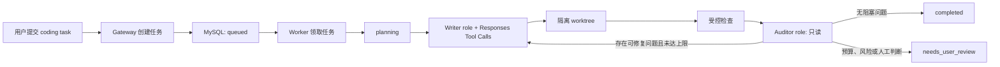
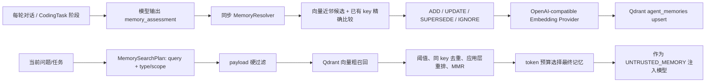
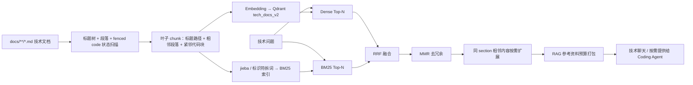
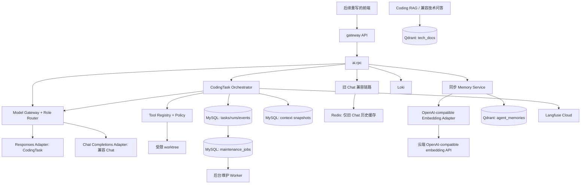
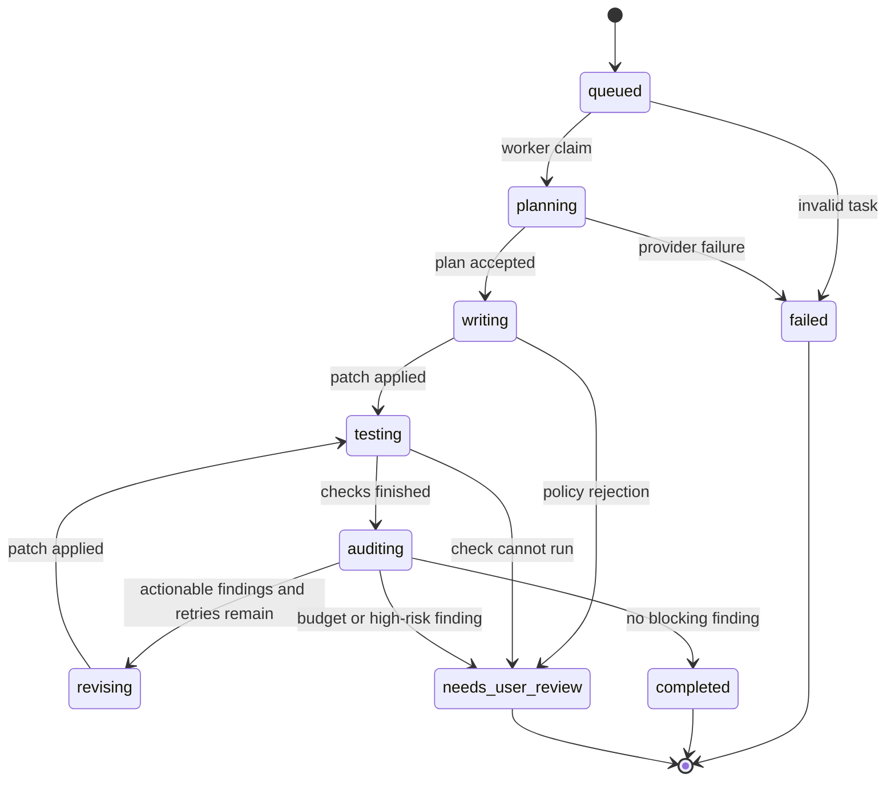

# ai-chat Coding Agent 技术设计

> 状态：旧 Chat 的安全与运行基线已实现并完成真实联调；本文中的技术文档 RAG、Context、Memory 与 Coding Agent 仍是后续实施设计。
>
> 本文只描述拟议架构、接口合同与验收方式；未确认的设计均列在“尚未确定的问题”中，不能据此直接实现。

## 1. 背景与目标

### 当前系统

项目现有链路是 `Gateway API -> ai.rpc -> Redis 历史 -> RAG 服务 -> DeepSeek Chat Completions`：

- Go + go-zero 提供 Gateway、User RPC、AI RPC；
- MySQL 存用户、会话和消息；Redis 缓存最近对话；
- `app/ragservice/embedding-service` 使用 `OpenAI(api_key, base_url)` 形式调用云端 embedding，并将技术文档存入 Qdrant `tech_docs` collection；
- AI RPC 当前只有普通聊天接口，不具备仓库工作区、工具调用、任务恢复或独立审计能力。

### 目标

面向单用户面试展示，实现可审计的 coding agent：

1. 以“职责路由 + Provider 合同”替代厂商耦合：初始配置可为 Writer 使用 DeepSeek、Auditor 使用 GPT-5.6，但业务模块不依赖厂商名称；
2. Writer 在受限 worktree 中读取仓库、提出并应用补丁、运行受控检查；Auditor 只读审计 diff、相关文件和真实测试结果；
3. 以任务状态机管理长任务、重试、预算与恢复；
4. 引入短期上下文和单用户长期记忆；
5. Memory V1 仅使用 Qdrant，支持前端查看、编辑、禁用和遗忘；
6. Chat、Coding Agent 和 embedding 均统一接入 Provider Gateway：同时保留 Chat Completions 与 Responses 适配器；CodingTask 优先使用 Responses 协议；
7. CodingTask 使用 MySQL 任务表、租约和幂等实现核心异步执行；Context Maintenance 使用可恢复的后台任务；
8. 对模型成本、缓存命中、工具调用、测试与审计证据进行可观测记录。

### 最终输出

用户提交编码任务后得到：任务进度、隔离工作区内的 diff、真实检查结果、GPT 审计报告、可追溯的运行记录。记忆界面提供个人记忆的浏览、编辑和检索。

## 2. 范围 / 非范围

### 本次范围

- 在现有 `ai.rpc` 中新增 coding-task 任务链路；
- 单用户 personal memory；
- Qdrant-only 的 `agent_memories` collection；
- 基于 OpenAI-compatible `/embeddings` 的云端 embedding provider；
- 不含厂商名的职责路由、通用 Chat Completions 适配器和 CodingTask Responses 适配器；
- 工具调用、状态机、前端任务与记忆页面的 API 合同；
- Langfuse LLM trace 与 Loki 后端日志的关联方案。

### 明确非范围

- 不改变用户登录；普通技术聊天保留为轻量兼容入口，但不再作为 Coding Agent 主链路；技术文档 RAG 是独立的检索实践，可按需向 Coding Agent 提供参考资料，但不承载本地源码检索；
- 不把文件拆成独立队列任务或实现多 agent DAG；
- 不实现 Git push、创建 Pull Request、网络抓取、任意 shell、删除文件；
- 不实现多用户共享记忆、组织权限、知识图谱和 Neo4j；
- 不预设 Top-K、相似度阈值、token 预算等生产数值；这些由评测集确定；
- V1 不引入 Redis Streams、Transactional Outbox、Kafka 或 CDC；它们仅作为出现真实多消费者事件分发需求后的演进方案；
- 不在本文阶段修改业务代码、数据库或运行中的服务。

## 3. 核心业务流程

### 3.1 Coding task 正常流程



状态机管理的是**一次任务 run**，并非为每个文件单独排队。它使服务重启、重复提交、外部模型超时和修复循环都可追踪、可恢复、可限额。

### 3.2 记忆写入与召回流程



`memory_key` 是不带语义的稳定事实槽位 ID，不由模型拼接候选词。写入时，Resolver 先在同一用户、同一 scope 的 active memory 中做少量向量近邻召回，判断候选是否属于已有槽位；若属于则复用其 `memory_key`，再以 `user_id`、`memory_key`、`status=active` 做 payload 精确读取和版本更新；若不属于则生成新的随机 key。读取记忆始终以语义向量检索为主，`memory_key` 不作为业务查询入口。

每轮模型都输出 `memory_assessment.should_write_memory`，但只有该字段为真且 Resolver 通过校验时才实际写入。该链路必须同步完成，确保“本轮确认的约束”下一轮立即可用；用户明确“记住”提高候选优先级，模型不得自行物理删除记忆。

### 3.3 技术文档 RAG 正常流程



RAG 数据源只限 `docs/**/*.md`，**不索引 `app/` 业务源码**。Markdown 不限制三级标题：章节父节点保存完整 `heading_path`；可检索叶子 chunk 保存 `section_id`、`chunk_order`、前后相邻 chunk ID、文件相对路径、起止行和内容哈希。叶子 chunk 的 embedding 文本为“完整标题路径 + 若干相邻自然段 + 紧邻 fenced code block/函数名/伪代码”，不将文档中少量代码默认拆成独立 `chunk_type=code`。`has_code` 最多作为调试元数据。

若一个组合后的叶子 chunk 超过 embedding 输入预算，只在其内部继续切分，并为每个子块重复标题路径和必要的相邻解释；不得静默截断。扫描器必须维护 fenced code block 状态，避免将代码中的 `#` 误判为标题。代码标识符不决定 chunk 边界，但在 BM25 分词时保留原词并拆分 camelCase、snake_case、kebab-case 和点路径；中文部分使用 `jieba`。

### 3.4 主要异常路径

- Qdrant 或 embedding 不可用：coding task 和普通聊天继续运行，只是不注入/写入长期记忆；记录可重试事件。
- 粗召回结果全部低于阈值：返回空记忆，不能为了填满 Top-K 传入无关内容。
- 用户编辑或遗忘记忆：更新 point payload 的 `status`、`content`、`version`，重新生成向量；遗忘采用软删除，不做物理删除。
- Writer 请求越权工具：Tool Policy 拒绝并记录安全事件，任务进入 `needs_user_review` 或 `failed`。
- 测试失败：保存完整产物引用和精简摘要，交给 Auditor；不得把“模型认为成功”视作检查成功。

## 4. 系统架构



`agent_memories` 与 `tech_docs` 必须是不同 collection：前者保存单用户个人记忆，后者保存项目技术文档，二者的权限、保留期、召回 scope 和 embedding 配置可能不同。

## 5. 模块设计

| 模块 | 为什么存在 / 职责 | 输入 | 输出 | 非职责 / 失败处理 |
|---|---|---|---|---|
| `CodingTask Orchestrator` | 编排状态机、预算和 Writer/Auditor 循环 | 任务 ID、任务配置 | 状态事件、最终 artifact | 不直接读写任意文件；provider 失败时按策略重试或终止 |
| `Task Worker` | 异步领取 `queued` 任务，避免 HTTP 长连接 | MySQL task record | 有租约的 run | 不决定业务状态；租约到期后可被恢复 |
| `Maintenance Worker` | 异步压缩历史、重建索引、执行 Eval 和汇总指标 | MySQL maintenance job | 可重试的维护结果 | 不参与当前模型调用；运行时缺少摘要时由 Context Manager 同步兜底 |
| `Model Gateway + Role Router` | 按 `chat`、`writer`、`auditor`、`memory_extractor`、`embedding` 职责选择配置，并归一化响应 | role、领域请求、能力要求 | 领域响应或标准错误 | 不含 DeepSeek/OpenAI/GPT 等厂商分支；不执行工具 |
| `Responses Adapter` | 将 CodingTask 的领域请求适配为 OpenAI Responses 协议 | provider request、tool schema、结构化输出 schema | 文本、结构化结果或 tool call | 不执行 tool；不支持该协议的供应商按能力降级或不可选 |
| `Chat Completions Adapter` | 为旧技术聊天和兼容供应商提供通用 OpenAI-compatible 调用 | chat request、tool schema | 文本或 tool call | 不承载 CodingTask 的 Responses 特有能力 |
| `Tool Registry + Policy` | 定义、校验并执行有限工具 | tool name、JSON args、workspace | tool result | 拒绝绝对路径、`..`、密钥、删除和非白名单命令 |
| `Context Manager` | 自管并同步组装约束、近期历史、worktree、检索结果和 token 预算 | 当前 run、事件、快照、token 预算 | provider-neutral 上下文包 | MySQL 快照为恢复依据；不依赖 `previous_response_id` 或 Redis 作为 Coding Agent 的事实来源 |
| `Memory Extractor` | 每轮让模型判断是否存在可复用的个人或会话记忆，并输出候选 | 当前对话或 CodingTask 阶段输出 | `MemoryCandidate` | 不直接写库、不决定 ADD/UPDATE/DELETE |
| `Memory Resolver` | 对候选进行脱敏、范围校验、向量近邻比对、`memory_key` 精确版本读取和决策 | `MemoryCandidate`、少量近邻、当前 active point | `ADD` / `UPDATE` / `SUPERSEDE` / `IGNORE` | 不作为回答时的主检索器；用户遗忘由单独 `FORGET` 操作处理 |
| `Memory Service` | 向量化、upsert、检索、编辑和软删除 | resolver decision、检索计划 | memory point / selected memories | 不跨用户召回；embedding 失败不阻塞主链路 |
| `Embedding Provider` | 屏蔽云模型供应商差异 | 文本数组、模型配置 | 固定维度 vector 数组 | 不决定 collection 或检索策略 |
| `Event Bus（V2）` | 向多个独立消费者广播已持久化领域事件 | outbox event | Redis Stream event | 不属于 V1 主链路；正式启用时必须配套 Outbox、Publisher、Consumer 幂等和补偿 |
| `Observability Adapter` | 关联 LLM 与后端证据 | `run_id`、阶段、usage | Langfuse trace / Loki log | 不向 Loki 发送原始 prompt、源码或密钥 |

## 6. 模块输入输出

### 6.1 长期记忆输入 / 输出

写入输入：用户 ID、候选事实或偏好、来源、scope、重要性/置信度候选值。

写入输出：Qdrant point ID、版本、状态、embedding 结果、可审计的写入事件。

召回输入：用户 ID、当前 query、当前 scope、允许类型、token 预算。

召回输出：最终记忆列表、每条 memory ID、过滤/重排原因、占用 token 估算；无相关内容时返回空列表。

### 6.2 Coding task 输入 / 输出

输入：任务描述、允许检查、预算、幂等键。服务端从固定 `workspace_root` 读取工作目录，并在创建时自行记录 `base_commit`。

输出：任务 ID、当前状态、阶段事件、diff artifact、测试 artifact、审计报告、Langfuse trace ID。

## 7. 核心接口

### 7.1 HTTP API 合同

```text
POST /v1/coding/tasks
GET  /v1/coding/tasks/{task_id}
GET  /v1/coding/tasks/{task_id}/events

GET    /v1/memories
PATCH  /v1/memories/{memory_id}
POST   /v1/memories/{memory_id}/forget
POST   /v1/memories/search
```

`POST /v1/coding/tasks` 必须显式进入 coding task，不能依赖普通聊天的意图识别。请求至少包含 `goal` 和 `idempotency_key`；工作目录由服务端固定配置，`base_commit` 由服务端在创建任务时记录。

记忆编辑接口必须只允许当前用户操作自己的 point；编辑后必须重新 embedding 并写入新 `version`。

### 7.2 Model Gateway 与 Provider 合同

```go
type EmbeddingProvider interface {
    Embed(ctx context.Context, texts []string) (EmbeddingResult, error)
}

type ModelGateway interface {
    Generate(ctx context.Context, role ModelRole, request ModelRequest) (ModelResponse, error)
}

type MemoryResolver interface {
    Resolve(ctx context.Context, candidate MemoryCandidate) (MemoryDecision, error)
}
```

这是领域合同，不绑定某个 SDK 或厂商。`ModelGateway` 根据 role 路由到配置的协议适配器：`writer` 和 `auditor` 优先使用 Responses；兼容技术聊天使用 Chat Completions；embedding 使用 `/embeddings`。领域层不接触 `/v1/responses`、`/v1/chat/completions` 的原始结构。

`MemoryCandidate` 至少包含 `should_write_memory`、`subject`、`predicate`、`value`、`scope`、`memory_type`、`semantic_summary`、来源引用。`memory_key` 由 Resolver 在向量近邻比对后复用已有 key 或生成新的随机 key；模型不能直接决定 `ADD`、`UPDATE` 或物理 `DELETE`。

### 7.3 OpenAI-compatible embedding 配置合同

```yaml
Embedding:
  ProviderID: "embedding_primary"
  BaseURL: "https://provider.example.com/v1"
  Model: "embedding-model-name"
  Dimensions: 1024
  TimeoutMs: 5000
```

`APIKey` 不写入 Git 跟踪的 YAML，应由环境变量或密钥管理系统提供。`Dimensions` 是 collection 合同的一部分；修改它必须新建 collection 或完整重建，不能直接覆盖已有向量。

```yaml
Providers:
  - ID: "coding_primary"
    Protocol: "responses"
    BaseURL: "https://provider.example.com/v1"
    Model: "model-name"
    Capabilities: ["tool_calling", "structured_output"]
  - ID: "chat_compatible"
    Protocol: "chat_completions"
    BaseURL: "https://provider.example.com/v1"
    Model: "model-name"

RoleRouting:
  Writer: "coding_primary"
  Auditor: "coding_primary"
  Chat: "chat_compatible"
  MemoryExtractor: "coding_primary"
```

这是配置形态，不包含真实 URL、模型名或密钥。初始 Writer/Auditor 可配置成不同 Provider ID，但不会产生 `DeepSeekProvider` 或 `OpenAIProvider` 这样的业务类型。

## 8. 数据模型

### 8.1 Qdrant `agent_memories` point

| 字段 | 类型/示例 | 含义 |
|---|---|---|
| `id` | 稳定 UUID | 记忆 point ID |
| `vector` | embedding vector | 由 `semantic_summary` 生成 |
| `user_id` | keyword/integer | 单用户隔离的强制过滤条件 |
| `scope` | `global` / `conversation` | 适用范围 |
| `scope_id` | conversation ID | 仅 conversation scope 的归属对象 |
| `memory_type` | `fact` / `preference` / `episode` / `summary` | 记忆类别 |
| `content` | 文本 | 用户可读、可编辑的记忆正文 |
| `semantic_summary` | 文本 | 用于 embedding 的归一化表达 |
| `subject` / `predicate` | 可选文本 | 结构化事实辅助字段 |
| `memory_key` | 稳定文本 | 同类事实的去重和覆盖依据 |
| `importance` | 数值 | 业务重要度，不等同于向量相似度 |
| `confidence` | 数值 | 事实可靠性 |
| `stability` | `fact` / `durable` / `temporal` | 决定是否施加时间衰减 |
| `status` | `active` / `superseded` / `forgotten` | 生命周期状态 |
| `version` | 整数 | 编辑、覆盖和并发保护 |
| `source_ref` | run/message 引用 | 来源追溯 |
| `created_at` / `updated_at` / `last_confirmed_at` / `expires_at` | 时间 | 近期性、确认与显式过期策略 |

推荐为 `user_id`、`scope`、`scope_id`、`memory_type`、`status`、`memory_key`、`expires_at` 建立 payload index，并在 collection 初建时完成。

### 8.2 Coding task 持久化数据

Coding task 的状态、租约、幂等键、artifact 引用继续放 MySQL，不能与 memory 的 Qdrant-only 决定混淆。建议核心实体为 `coding_tasks`、`coding_task_events`、`coding_task_artifacts`、`agent_context_snapshots`、`maintenance_jobs`。`maintenance_jobs` 承担压缩、索引、Eval 等低优先级可恢复工作，不是 V1 的消息总线。

### 8.3 Coding Agent 上下文快照

`coding_task_events` 记录用户指令、结构化计划、工具调用、工具结果、测试结论和审计 finding；`agent_context_snapshots` 保存可恢复的 `context_version`、对应事件范围、结构化快照和 artifact 引用。每次模型调用由 Context Manager 从这些持久化事实重新打包，进程内存只缓存当前调用。

Provider 返回的 response ID 可以作为 Langfuse/调试关联字段保存，但不作为恢复上下文的主键，也不使用 GPT 的 `previous_response_id` 作为正确性依赖。这样 GPT 与 DeepSeek 都接收同一套应用层上下文，任务可在重启或 Provider 切换后恢复。

## 9. 状态生命周期



`queued`、`planning` 等状态作用是防重、恢复、限额和展示进度，不代表每个文件单独处理。一个任务内部可以修改多个文件，但仅有一个持久化 run。

## 10. 存储设计

### 10.1 Memory V1：Qdrant-only

- Qdrant 是 personal memory 的唯一业务存储和语义检索引擎；
- point payload 保存正文、结构化字段、状态和来源；向量由 `semantic_summary` 生成；
- 用户编辑会更新正文和向量；遗忘采用 `status=forgotten`；
- 不将 memory point 与现有 `tech_docs` collection 混用；
- 不依赖 MySQL 回查 memory 原文。

### 10.2 写入决策、召回与重排策略

写入时先在 `user_id + scope + status=active` 范围内做少量向量近邻召回，由 Resolver 判断候选与近邻是否为同一事实槽位。若是，复用该近邻的 `memory_key`，再按 `user_id + memory_key + status=active` 做 payload 精确读取；相同事实则 `IGNORE`，明确修正则 `UPDATE`，互斥的新事实将旧记录标记为 `superseded` 并 `ADD` 新版本。若不是同一槽位，生成新的随机 `memory_key`。`FORGET` 仅由用户显式操作触发，并标记 `forgotten`。

```text
当前问题/任务
-> MemorySearchPlan(query + type/scope)
-> user_id/scope/status/type hard filter
-> Qdrant coarse recall (candidate_limit > final_k)
-> score threshold gate
-> conflict removal and deduplication
-> relevance + importance + confidence + recency + scope rerank
-> MMR diversity selection and token budget pack
-> final memories or empty list
```

最终 `K` 可以为 0。必须通过评测集校准：相似度分数在不同 embedding 模型、维度和距离度量下不可直接复用。

Memory V1 先实现稠密检索、硬过滤、阈值和应用层重排。`MMR` 在多个高分候选近似重复时保留相关性并惩罚相互相似的候选。技术文档 RAG 在阶段 1 实现 Dense + BM25 + RRF + MMR；RRF 的候选数、MMR 系数和是否再引入独立 reranker，仍由评测决定。

### 10.3 短期上下文压缩

较早对话压缩为任务快照，字段为：

| 字段 | 作用 |
|---|---|
| `goal` | 本任务要交付的结果 |
| `constraints` | 不可违反的权限、范围、技术约束 |
| `work_summary` | 有类型的事件列表，合并已确认决策与文件变更意图 |
| `tests_and_results` | 真实检查命令、结论与关键失败信息 |
| `open_issues` | 未解决阻塞和下一步 |
| `task_state` | 当前状态机阶段 |
| `important_preferences` | 与本任务相关的用户偏好 |
| `artifact_refs` | 完整 diff、长日志、原始消息的引用 |
| `source_turn_range` | 此摘要覆盖的对话范围 |

压缩只减少模型上下文，不替代原始 artifact，也不自动变成长期记忆。Coding Agent 的事实来源是 MySQL 事件和快照：每轮按“稳定 Developer/System Prompt → 工具 Schema → 已确认计划/快照 → 召回内容 → 本轮动态用户输入、diff、测试结果”的顺序打包。稳定前缀有利于各 Provider 自己的 KV Cache 命中，但 GPT 与 DeepSeek 之间不共享缓存。

压缩和索引更新优先作为 `maintenance_jobs` 异步执行；当本轮 Context 已超预算且后台摘要未完成时，Context Manager 必须同步压缩兜底。Redis 只可作为旧 Chat 的历史缓存，不能作为 Coding Agent 上下文的持久化来源。Qdrant 长期记忆默认不因时间物理删除；`stability=fact` 的 `time_weight=1`，`stability=temporal` 才按时间衰减；`expires_at` 只表示明确有时效的事实，不能代替相关性评分。

### 10.4 技术文档 RAG 存储、召回与预算

新索引使用 `tech_docs_v2` collection，不覆盖旧 `tech_docs`。Qdrant point payload 至少包括 `document_id`、`section_id`、`chunk_id`、`chunk_order`、`heading_path`、`text`、`line_start`、`line_end`、`previous_chunk_id`、`next_chunk_id`、`content_hash` 和可选 `has_code`。离线索引同时在 `out/rag-index/tech_docs_v2/` 生成已忽略的 `manifest.jsonl` 与 `bm25_index.json`；二者带同一 `index_version`，RAG 服务加载时必须校验与 Qdrant 索引批次一致。

Dense 召回与 BM25 各取候选，使用 RRF 合并 `chunk_id` 排名，再用 MMR 去除高度重复内容。命中子 chunk 后，只有在参考资料预算仍有余量时，才通过 `section_id` 补充前后相邻 chunk；不能因为命中一个章节就自动注入完整章节。RAG 参考资料最终可以为空。

token 限制分两层：第一层是 embedding 输入预算，约束单个“标题路径 + 正文 + 紧邻代码”叶子 chunk；第二层是召回后的总参考资料预算，约束进入 Chat/Coding 上下文的最终资料。OpenAI-compatible embedding API 没有统一 tokenizer 合同，因此 embedding 上限、token 估算器、候选数、RRF/MMR 参数和总预算都必须由模型能力与评测集确定，不能在本文写成通用生产数值。

### 10.5 事件总线与可靠投递演进（V2 以后）

V1 不使用 Redis Streams 或 Outbox 触发核心 CodingTask、每轮记忆写入或运行时 Context 组装。它们分别依赖 MySQL 任务表、同步 MemoryResolver 和 Context Manager。

当出现多个真正独立的异步消费者（例如通知、Eval、指标投影、批量索引）时，演进为：

```text
MySQL 事务
├── 更新 coding task 状态
└── INSERT outbox_events（event_id、event_type、aggregate_id、payload_ref、published_at=NULL）
      ↓
Outbox Publisher 轮询未发布事件
      ↓
Redis Streams XADD
      ↓
多个 Consumer Group
```

Outbox 不是 Redis 命令记录，而是“已发生且必须传播的领域事件”。它将 MySQL 状态与待发布事件放入同一事务，保证二者同时成功或同时回滚；Publisher 成功 `XADD` 后才标记 `published_at`。若 `XADD` 成功但标记失败，事件会重发，因此语义为 at-least-once，消费者必须幂等。

Redis Streams Consumer 的规则：事件携带稳定 `event_id`；完成可持久化副作用后才 `XACK`；Pending 消息经 claim 后重试；处理结果按 `(consumer_name, event_id)` 去重；超过重试上限进入死信记录并告警。索引任务以确定性 chunk/point ID upsert，摘要任务以 `conversation_id + source_turn_range + summarizer_version` 去重。所有事件流记录 `event_id`、`task_id`、`run_id`、消费组、attempt 和耗时，但不记录完整 Prompt、源码或密钥。

## 11. 异常处理

| 场景 | 处理 |
|---|---|
| 非法 task 请求 | Gateway 校验字段、固定 worktree 配置和幂等键，拒绝创建 run |
| embedding 超时/模型失败 | 当前 run 保留短期 memory delta，长期 Qdrant 写入记录为可重试 maintenance job；主任务降级继续 |
| Qdrant 不可用 | memory 功能降级；coding task 不因记忆缺失失败 |
| 重复 memory 写入 | Resolver 先在同一用户/scope 内检查少量向量近邻，再复用候选的 key 做 payload 精确版本读取；语义近似不等于同槽位，最终由 Resolver 决定 `UPDATE` / `SUPERSEDE` / `IGNORE` |
| 低相似度 Top-K | 阈值淘汰，返回空列表 |
| 用户编辑冲突 | 以 `version` 检测；版本不一致时返回冲突而非覆盖 |
| provider 响应无效 | 不执行工具；记录 provider error 并按任务预算有限重试 |
| 服务重启 | 未完成 task 依靠 MySQL 租约重新领取；maintenance job 依靠租约重试；memory upsert 以稳定 point ID 保持幂等 |

## 12. 并发 / 幂等 / 一致性

- 创建 coding task 使用 `(user_id, idempotency_key)` 唯一约束；
- worker 通过条件更新和 `lease_until` 领取任务，避免同一 run 双执行；
- memory 写入先以向量近邻判断是否复用 slot，再使用稳定 point ID + `memory_key`，并要求 `version` 单调递增；同一用户/同一 key 的并发 Resolver 必须在应用层串行化或使用条件版本重试，因为 Qdrant 不提供关系型唯一约束；
- maintenance job 使用 `(job_type, dedupe_key)` 唯一约束、租约和有限重试；同一压缩/索引工作不会无限重复创建；
- 编辑记忆时携带前端已读 `version`，不一致则提示刷新后再编辑；
- embedding 成功但 Qdrant upsert 失败时，重试同一个 point ID，不创建重复记忆；
- 所有 task artifact 放在 `out/<task_id>/`，并加入 `.gitignore`；产物路径只保存引用，不进入 prompt 全文。

## 13. 安全边界

- `user_id` 是 memory 查询不可绕过的 payload filter；
- repo 文本、RAG 文档、tool output、memory 均属于 `UNTRUSTED_DATA`，不可改变 system policy；
- 禁止以关键词正则直接拒绝代码、JSON、`system`、`{}` 等正常输入；
- 后端 Tool Policy 是安全边界：限制 worktree 根目录、拒绝密钥文件/绝对路径/路径穿越/删除/任意 shell；
- Auditor 只读，不能拥有 `apply_patch` 或执行写操作；
- embedding、LLM、Langfuse 密钥由环境变量或密钥管理提供，绝不写入 Git；
- Langfuse 与 Loki 均要脱敏；Loki 不记录完整 prompt、源码、模型响应或 token。

## 14. 可观测性

### Langfuse

每个 coding task 对应一条主 trace，嵌套记录：

```text
coding-run
  planning generation
  writer Responses generation
  tool observations
  test span
  auditor Responses generation
  memory retrieval / memory extraction observation
```

generation 必须记录 Provider ID、协议、模型、prompt 版本、input/output/reasoning token、cache hit/miss、真实成本和 `run_id`。memory 召回记录检索计划、候选数、阈值淘汰数、MMR 剔除数、最终 memory ID、最终 token 数；不记录不必要的原文。

### Loki

Loki 保存传统 Go 服务日志：`request_id`、`run_id`、Langfuse trace ID、状态迁移、worker 租约、RPC/数据库/Redis/Qdrant 错误和耗时。Loki 不承担 LLM prompt 与成本的主分析职责。

所有数据流均需要结构化日志，至少覆盖 task 创建、领取、状态迁移、工具拒绝、embedding 调用、Qdrant upsert、检索筛选、maintenance job 领取/重试和最终任务结果。日志关联 `task_id`、`run_id`、`job_id`、attempt；不记录完整 Prompt、源码或密钥。

## 15. 测试方案

| 类别 | 测试 |
|---|---|
| Happy Path | 给定有效单用户偏好，写入后用同义问题召回对应记忆 |
| Boundary | 给定低相关 query，所有分数低于阈值时返回空列表 |
| Permission | 用户 A 创建的 memory，用户 B 的过滤查询永远不可见 |
| 编辑一致性 | 两个编辑者使用同一旧 version，只有第一个成功，第二个得到冲突 |
| 遗忘 | 标记 `forgotten` 后，语义最相似查询也不得返回该 point |
| 去重/覆盖 | 相同 `memory_key` 的新事实覆盖或 supersede 旧事实，不产生两个 active 冲突值 |
| Resolver 去重 | 写入相近候选时验证先检查少量向量近邻、再对复用的 key 做 payload 精确版本读取；不因单纯相似而错误合并 |
| Memory Assessment | 每轮输出 `should_write_memory=false` 时不得写入；为 true 且通过 Resolver 时下一轮即可读到该约束 |
| Context Maintenance | 异步摘要未完成且上下文超预算时，运行时同步压缩兜底；正常情况下摘要/索引不阻塞模型调用 |
| Maintenance Recovery | worker 在索引/压缩中断后，租约过期可重领同一 dedupe key 的 job，结果不重复 |
| Provider Integration | 替换 `BaseURL`、`Model`、`APIKey` 后，以 mock OpenAI-compatible Chat/Embeddings 与 mock Responses server 验证请求合同 |
| Task Recovery | worker 在 `writing`/`testing` 中断，租约过期后任务可安全恢复 |
| Tool Permission | Writer 请求绝对路径、`.env`、删除或非白名单命令时被拒绝且不改变工作区 |
| Audit Loop | Auditor 给出阻塞 finding 时仅在重试未耗尽时进入 `revising` |
| RAG Chunk | 给定多级标题、相邻段落与紧邻代码块，Then 生成一个带完整标题路径的叶子 chunk，不默认拆出独立代码 chunk |
| RAG Retrieval | 给定中文概念、函数名、camelCase 或 snake_case 查询，Then Dense/BM25 均能产出候选，RRF 后按 MMR 去重且可追溯到标题、行号和 section |
| RAG Budget | 给定大量高分候选，When 参考资料超过总预算，Then 只保留按分数和多样性选择的内容，必要时按 section 补相邻 chunk，不注入完整文档 |
| Retrieval Quality | 用人工标注 query-memory 与 query-document 测试集比较 Recall@candidate、Precision@final、无关注入率和成本 |

## 16. 验收标准

- Given 单用户已确认“吃面偏好红油”，When 查询“吃面有什么偏好”，Then 返回该记忆并可解释来源。
- Given 新候选语义接近已有记忆，When Resolver 处理，Then 先检查近邻是否为同一事实槽位；确认复用时再按 `memory_key` 精确读取当前 active point。
- Given 用户只问 coding agent，When 召回个人记忆，Then 不注入篮球等无关爱好；若无合格记忆则返回空列表。
- Given embedding provider 的 Base URL 被替换为另一兼容服务，When 进行写入和检索，Then 调用合同无需修改 Memory Service。
- Given 用户在前端编辑或遗忘一条记忆，When 后续检索，Then 新版本生效、遗忘版本不再召回。
- Given 同一 task 重复提交相同幂等键，When Gateway 处理，Then 只创建一个 run。
- Given Writer 请求违反工具策略，When Tool Policy 校验，Then 工作区不发生变化且有结构化日志。
- Given 服务在任务中断后重启，When 租约到期，Then 可恢复的任务可重新领取而不重复写同一补丁。
- Given DeepSeek 不支持 GPT 的 response ID 续接，When Coding Agent 恢复任务或切换 Provider，Then 从 MySQL 事件和 `agent_context_snapshots` 重组相同上下文，而非依赖 `previous_response_id`。
- Given 文档检索命中一个子 chunk，When 同章节相邻内容仍在预算内，Then 只补充必要邻居，并保留完整 `heading_path` 与行号。

## 17. 风险

- Qdrant-only 将结构化 payload、版本和事实生命周期的复杂度放到应用层；未来多用户协作/复杂审计可能需要 MySQL 元数据层。
- Responses 是 CodingTask 的首选协议；替换为仅支持 Chat Completions 的兼容供应商时，必须明确降级能力，不能假设所有工具、结构化输出与缓存特性等价。
- embedding 模型变更或维度变更会使旧向量不可比较，必须新 collection + 全量重建。
- 相似度阈值没有通用正确数值；未做评测前设置过高会漏召回，设置过低会注入噪声。
- 云 embedding 与云 LLM 均有延迟、限流、计费与隐私风险，需要超时、重试和脱敏。
- BM25 索引与 Qdrant collection 若不是同一批次，RRF 会融合错误 chunk；必须以 `index_version` 拒绝不一致的索引。
- 仅用字符数估算 token 可能超过某个 embedding Provider 的真实上限；未接入该模型 tokenizer 时需保留保守余量并以 API 拒绝结果校准。
- Tool Call 若开放任意 shell 或工作区边界不严，会带来高风险；第一版必须保持工具集很小。
- Langfuse Cloud 若记录原始 prompt/源码，可能产生敏感数据外泄；接入前需确定脱敏与数据保留策略。
- Redis Streams 与 Outbox 启用后会引入 at-least-once 重投、消费者去重、死信和发布延迟；在没有多个独立消费者前引入它们是过度设计。

## 18. 尚未确定的问题

| 问题 | 方案 A | 方案 B | 取舍 | 推荐 |
|---|---|---|---|---|
| 云 embedding 供应商与模型维度 | 选择固定供应商/维度 | 选择任意 OpenAI-compatible 云服务 | 后者可替换，但 collection 重建更常见 | 先保持 Provider 可换，确认供应商后再填默认值；变更维度必须新建 collection |
| 短期会话缓存 TTL | 固定较短 TTL | 按活跃会话延长 TTL | 前者成本可控；后者连续会话体验更好 | 作为配置项保留，先不把数值写死；长期 Qdrant memory 不设置统一硬 TTL |
| 时间衰减参数 | 仅区分 fact/temporal | 对 preference 也做轻度衰减 | 后者更容易反映偏好变化，但可能错过稳定偏好 | `fact` 不衰减，`temporal` 衰减；其他类型由标注集评估后决定 |
| 检索数值 | 先给固定 Top-K、阈值和 MMR 系数 | 先建立标注集后校准 | 固定值实现快但不可解释 | 先保留配置项，用 Recall、Precision、无关注入率和成本评测确定 |
| embedding token 估算 | 使用 Provider tokenizer | 使用保守字符估算 | 前者准确但供应商相关；后者可替换但可能不精确 | 接入已选云 embedding 的 tokenizer；未确定前使用保守估算并由失败样本校准 |
| Markdown 解析 | 受控文档使用逐行扫描/标题正则 | 使用完整 Markdown AST parser | 前者无新依赖；后者兼容性更好 | V1 使用带 fenced-code 状态的扫描器，复杂文档出现后升级 |
| Coding Provider 路由 | Writer/Auditor 共用一个 Responses Provider | 使用不同 Provider ID | 共用简单；拆分可比较质量和成本 | 合同支持不同 Provider ID，真实路由在供应商与预算确认后填写 |
| 任务进度推送 | 前端轮询 | SSE | 轮询实现简单；SSE 体验更好 | 先轮询，任务稳定后增加 SSE |
| 事件总线启用时机 | V1 直接使用 Redis Streams + Outbox | 出现多消费者后再引入 | 前者可提前实践事件驱动；后者避免闲置基础设施 | V1 使用 MySQL task/maintenance job；确认出现独立通知、Eval、指标等消费者后启用 Outbox + Redis Streams |

### Scope 定义

- `global`：此用户所有会话都可用，例如“回答和代码修改前先分析，未经确认不写代码”。
- `conversation`：只适用于当前聊天/当前 coding task，例如“本轮决定 Memory V1 只用 Qdrant”。

## 19. 分阶段实施计划

### 阶段 0：基线修复与安全边界

- 目标：修复会话归属、可猜测 session ID、Redis miss 回读、日志脱敏、生成物忽略规则。
- 预期模块：Gateway、AI RPC 会话模型、SQL migration、`.gitignore`。
- 验收：会话权限测试、重试幂等测试、日志脱敏检查、`git status` 无运行产物。

### 阶段 1：技术文档 RAG V2

- 目标：仅索引 `docs/**/*.md`，实现标题路径 + 段落 + 紧邻代码块切分、新 `tech_docs_v2` collection、jieba BM25、Dense/RRF/MMR、章节邻居扩展和两层 token 预算。
- 预期模块：Markdown 扫描器、OpenAI-compatible embedding 配置、Qdrant 索引器、BM25 离线索引、RAG 服务和小型人工标注集。
- 验收：标题/代码组合 chunk、中文与标识符查询、RRF/MMR、索引版本和参考资料预算测试。

### 阶段 2：统一 Provider Gateway 与 Qdrant Memory V1

- 目标：实现去厂商耦合的 Provider Gateway、同时保留 Chat Completions/Responses Adapter、OpenAI-compatible embedding、`agent_memories` collection、每轮记忆判断、单用户 CRUD、编辑/遗忘和检索管线。
- 预期模块：Model Gateway、Chat/Responses/Embedding adapters、RAG/Memory 服务、provider 配置、Qdrant collection 初始化、Memory API。
- 验收：本文件第 15、16 节的 memory 测试和小型人工标注检索集。

### 阶段 3：Coding task 状态机、维护任务、Context 快照与只读工具

- 目标：可创建、查询、恢复 coding task；以 MySQL 事件/上下文快照而非 Redis/response ID 恢复上下文；先支持读文件、搜索、diff 和白名单检查，并在本机受限 worktree 中运行；将压缩、索引、Eval 放入可恢复的 maintenance job。
- 预期模块：Gateway API、AI RPC codingtask、MySQL task/context snapshot/maintenance job 表、worker、artifact 目录、Context Manager。
- 验收：状态恢复、上下文重组、维护任务租约恢复、重复提交、工具权限和 artifact 产物测试。

### 阶段 4：Writer、Auditor 与受控补丁

- 目标：接入 Responses Writer/Auditor、结构化 `memory_assessment`、有限修复循环和 `apply_patch`。
- 预期模块：role routing、Responses adapter、tool policy、audit schema、memory resolver、context manager。
- 验收：mock provider 集成测试、真实小仓库任务、审计 finding 回归测试。

### 阶段 5：可观测性与成本评测

- 目标：接入 Langfuse、关联 Loki、采集 token/cache/cost，并通过评测确定阈值、K 和预算。
- 预期模块：observability adapter、评测 fixtures、前端运行详情。
- 验收：一条 task 可从 `run_id` 跳转 Langfuse；指标可对比不同 embedding/provider 和检索策略。

### 阶段 6：事件驱动演进（按需）

- 前置条件：确认存在两个以上独立、可容忍异步的消费者，例如通知、Eval、指标投影或批量索引。
- 目标：引入 `outbox_events`、Outbox Publisher 和 Redis Streams Consumer Group；核心 CodingTask、每轮 MemoryResolver 与运行时 Context 仍不依赖该事件总线。
- 预期模块：领域事件合同、Outbox 表与 Publisher、Redis Stream、消费者幂等记录、Pending claim、死信与补偿扫描。
- 验收：Publisher 在 MySQL 提交后可靠重试；同一 `event_id` 重投不产生重复副作用；消费者崩溃后可 claim Pending 并最终 ACK。

## 文档维护说明

本文尚未新增可运行命令或生效配置。进入实施阶段后，如新增配置项、环境变量或启动命令，需要同步更新项目 README，并以“输入、输出、参数、完整示例”为优先内容。
