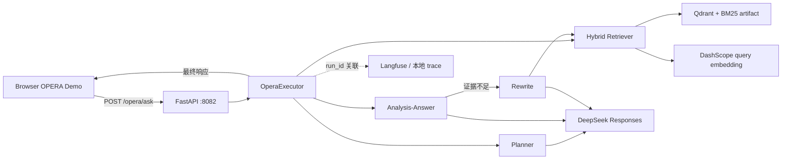
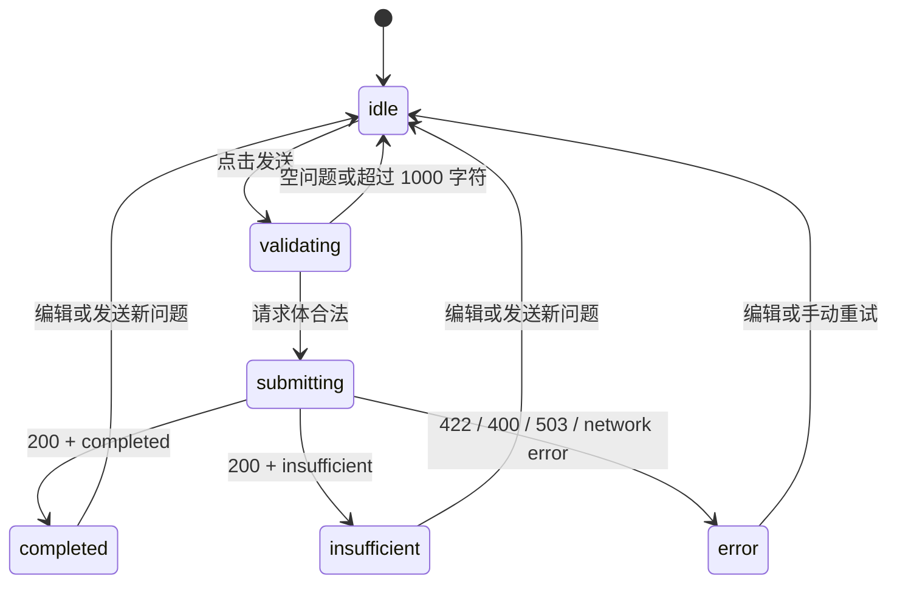

# OPERA 演示前端交接

> 本文是为后续前端开发 Agent 准备的一期交接合同。开始实现前先阅读 [README](../../README.md)、[RAG 链路](rag链路.md)、[技术选型](技术选型.md) 与本文件；接口真实实现以 `app/ragservice/embedding-service/main.py`、`opera/schemas.py` 为准。

## 1. 背景与目标

项目已有一个面向 HotpotQA 的 OPERA-style Multi-Agent Multi-hop RAG 后端。它通过 `POST /opera/ask` 执行 Planner → Hybrid Retriever → Analysis-Answer → Rewrite 闭环。

一期前端的使用者是本地面试演示者。目标是让他输入一个可由 HotpotQA 语料回答的多跳问题，直观看到最终回答、回答状态、最终证据引用与本次运行 ID；不是构建通用聊天产品。

## 2. 范围与非范围

### 一期范围

- 新建一个**独立的 OPERA 演示页**，不修改或复用旧 Chat 的业务调用。
- 默认调用 `POST /opera/ask`，`retrieval_scope` 固定为 `all`，`top_k` 默认 `3`。
- 提供问题输入、发送按钮、请求中 Loading、成功、证据不足和服务错误的明确状态。
- 展示 `answer`、`run_id`、`completed_step_count` 与 `final_evidence` 的 `chunk_id`、`sentence_index`。
- 在页面上说明语料范围是 HotpotQA，而非联网或项目源码问答。

### 明确不做

- 不接入旧 Gateway `/v1/ai/chat`、JWT、MySQL、Redis 或会话历史。
- 不把 `ExecutionState` 当作多轮记忆；每次提问都是独立请求。
- 不在浏览器直接访问 `out/opera-traces/`、Qdrant、DashScope、DeepSeek 或 Langfuse。
- 不伪造 Planner、检索、Analysis 或 Rewrite 的实时步骤。
- 不为 `case` scope 编写普通用户入口。它仅用于 HotpotQA 评测，必须由评测器提供 `_id`。
- 不自动重试用户请求。每次 `/opera/ask` 都可能产生 embedding 与模型成本，重复发送会重复计费。

## 3. 当前架构与调用链



浏览器只消费 FastAPI 的最终 HTTP 响应。Langfuse 和 `out/opera-traces/<run_id>.json` 是服务端观测设施：前者可能包含受控原文，后者是服务器本地文件；两者都不是浏览器 API。

现有 `frontend/index.html` 是旧 Chat 初版，向 `http://localhost:8888/v1/ai/chat` 发送 JWT 请求。它与 OPERA 的无鉴权 `:8082/opera/ask` 不是同一合同，必须保留原状。

## 4. 后端接口合同

### 4.1 请求

```http
POST http://127.0.0.1:8082/opera/ask
Content-Type: application/json
```

```json
{
  "question": "What screenwriter with credits for Evolution co-wrote a film starring Nicolas Cage and Tea Leoni?",
  "retrieval_scope": "all",
  "top_k": 3
}
```

| 字段 | 一期页面取值 | 约束 |
| --- | --- | --- |
| `question` | 用户输入 | 必填，1–1000 字符；提交前应 `trim`，空值不得发送。 |
| `retrieval_scope` | 固定 `all` | `all` 时**不得**发送 `case_id`。 |
| `top_k` | 默认 `3` | 可暂不放入 UI；若后续暴露，只允许整数 1–10。 |
| `case_id` | 不发送 | 仅 `case` scope 可用，普通演示不显示。 |

### 4.2 成功响应

```json
{
  "run_id": "<uuid>",
  "status": "completed",
  "answer": "<final answer>",
  "final_evidence": [
    {"chunk_id": "<case_id>:<paragraph_index>", "sentence_index": 0}
  ],
  "completed_step_count": 2
}
```

| 字段 | 页面行为 |
| --- | --- |
| `status=completed` | 显示 `answer`、步骤数和证据引用。 |
| `status=insufficient` | 显示“现有 HotpotQA 证据不足，系统未生成答案”；`answer` 为 `null` 属于正常结果。 |
| `run_id` | 可复制；提示用户可用它在 Langfuse 或本地服务端 trace 中排查。 |
| `final_evidence` | 仅以 `chunk_id`、`sentence_index` 渲染引用列表；不要假装能够展示正文。 |
| `completed_step_count` | 以“已完成 N 个子目标”展示，不推断实际 Plan 内容。 |

### 4.3 错误响应与页面映射

| HTTP 情况 | 含义 | 页面文案与操作 |
| --- | --- | --- |
| `422` | FastAPI/Pydantic 请求体校验失败，例如 `all` 错传 `case_id` | 提示“请求参数无效”，保留用户输入供修改。 |
| `400` | Agent Schema/Pydantic 校验或当前 provider 空输出等运行期校验失败 | 提示“本次 Agent 输出不可用，请稍后手动重试”；不要自动重发。 |
| `503` | Qdrant、BM25 artifact、DashScope 或 DeepSeek 不可用 | 提示“RAG 服务暂不可用，请检查服务与依赖”；不要显示为“没有找到答案”。 |
| 网络错误 / 浏览器主动取消 | 前端无法连接 API 或用户取消 | 提示“无法连接 OPERA 服务”，允许用户手动重新提交。 |

注意：旧文档部分文字将 `case/all` 校验描述为 `400`，但这类 Pydantic 请求体校验会在 FastAPI 路由之前产生 `422`。前端按上表实现，不依赖错误正文的稳定措辞。

## 5. 页面模块与状态生命周期

| 模块 | 输入 | 输出 | 不负责的事 |
| --- | --- | --- | --- |
| 问题输入区 | 用户问题 | 经 trim 后的请求体 | 解释数据集、保存会话、管理 API key。 |
| 请求控制器 | 请求体、API base URL | `fetch` 响应或可分类错误 | 自动重试、直接调用模型或读取本地文件。 |
| 运行状态区 | `idle` / `submitting` / `completed` / `insufficient` / `error` | Loading、禁用按钮、错误提示 | 伪造后端内部的细粒度进度。 |
| 答案卡片 | `answer`、步骤数 | 可读的最终答案 | 根据未返回的证据正文补全内容。 |
| 证据与调试区 | `final_evidence`、`run_id` | 引用列表、复制 run ID | 读取 trace、展示 Langfuse 私有数据。 |



请求进行中必须禁用发送按钮，避免双击产生两条独立、可能计费的执行。取消或超时只取消浏览器等待，当前后端没有取消协议，也不能保证已经发出的模型调用停止；不要据此实现“安全的取消并退款”语义。

## 6. 跨域、部署与安全边界

当前 FastAPI 只有 `/search`、`/opera/ask`、`/health` 三条 HTTP 路由，未配置 CORS，也未托管静态前端文件。前端 Agent 不得直接假设浏览器可从任意端口调用 `:8082`。

实现前必须由用户在以下方案中确认一种：

| 方案 | 改动 | 优点 | 代价 | 推荐场景 |
| --- | --- | --- | --- | --- |
| A：前端开发服务器代理 | Vite/其他开发服务器将同源 `/api` 转发到 `127.0.0.1:8082` | 不改 RAG 服务；本地演示最小风险 | 需要确定前端构建工具与启动命令 | **本地面试演示，推荐** |
| B：FastAPI 精确 CORS 白名单 | RAG 服务增加受限 `allow_origins` | 前端可直连 API | 要维护 origin 白名单，不能使用宽泛生产配置 | 固定前端来源时 |
| C：Gateway 新增 OPERA 转发 API | Go Gateway → Python RAG 服务 | 可统一 JWT、限流和部署入口 | 涉及 Go API、鉴权与超时设计，不是一期最小改动 | 以后要对外提供功能时 |

无论选择哪一种，浏览器只知道公开的 API base URL，绝不能接触 `DEEPSEEK_API_KEY`、DashScope key、Langfuse secret 或 Qdrant 地址。OPERA 当前未实现用户鉴权；如从本机演示扩展到公网，必须先完成方案 C 或等价的反向代理鉴权和限流设计。

## 7. 观测与后续 Trace 面板

一期页面只展示 `run_id`。当前后端不会把 Plan、检索段落、Analysis 或 Rewrite 放进 `/opera/ask` 响应；这是避免将内部调试数据与可能包含原文的资料直接暴露给浏览器。

若后续确认要做“执行过程面板”，必须先单独设计并实现一个受控后端读取接口，例如：

```text
GET /opera/runs/{run_id}
```

该接口至少要明确：调用权限、trace 保留期限、是否脱敏 paragraph 正文、`run_id` 不存在时的响应、并发读取和禁止路径穿越。不能让浏览器以 `run_id` 拼接服务器文件路径，也不能让浏览器直接调用 Langfuse API。

## 8. 验收与测试

| Given | When | Then |
| --- | --- | --- |
| FastAPI、Qdrant 和索引均可用 | 输入合法 `all` 问题并发送 | 页面只发出一次请求，并展示后端返回的 `completed` 结果。 |
| 后端返回 `insufficient` | 请求完成 | 页面不显示虚构答案，明确提示证据不足并保留 run ID。 |
| 输入为空或超过 1000 字符 | 点击发送 | 不发送 HTTP 请求，给出本地校验提示。 |
| 后端返回 `422`、`400` 或 `503` | 请求完成 | 三类状态文案不同；用户输入保留，页面不自动重试。 |
| 用户连续双击发送 | 首个请求未完成 | 第二次操作无效，避免重复计费。 |
| 返回多个 `final_evidence` | 页面渲染响应 | 每个引用显示真实的 chunk ID 与 sentence index，不假造正文。 |
| 运行于独立前端端口 | 调用 OPERA | 必须通过已确认的代理或 CORS 方案成功；不得依赖浏览器关闭跨域保护。 |

## 9. Open Questions（实现前必须确认）

1. 采用方案 A、B 还是 C 作为浏览器到 OPERA 的接入方式？推荐先选 A。
2. 前端技术栈是否允许新增 Node/Vite/React/TypeScript 依赖，还是必须维持单个原生 HTML 文件？现有仓库没有 `package.json`，不可自行假定。
3. 一期是否只需要最终答案页，还是需要做 trace 面板？后者需要新增后端 API，不能只改前端。
4. 是否要把 OPERA 演示页放入现有 `frontend/` 目录，还是创建独立前端工程？无论选择哪种，旧 `frontend/index.html` 必须保持旧 Chat 用途。
5. 面试演示是否需要公网部署？若需要，当前无鉴权的 `:8082` 不能直接暴露。

## 10. 建议实施阶段

1. **方案确认**：用户确认接入方式、技术栈、目录与是否只做最终答案页。
2. **独立页面**：实现输入、请求控制器、状态机、答案和证据引用；不改旧 Chat。
3. **本地联调**：按 README 启动 Qdrant 与 FastAPI，用一条 `all` 问题验证成功、`insufficient` 与服务不可用状态。
4. **可选二期**：用户确认 trace 数据暴露策略后，单独设计后端 `run_id` 查询 API，再实现真实过程面板。

## 11. 交接给前端 Agent 的硬约束

- 先提交页面/接入方案并等待用户确认，再写前端代码；不得自行选择 CORS、Gateway、鉴权或 Langfuse 访问方案。
- 不改现有 Go 用户认证、旧 Chat 与 `frontend/index.html`，除非用户明确扩大范围。
- 所有浏览器可见错误都使用中文；代码、变量、接口字段保持英文。
- 不在前端日志、构建产物或代码中写入任何 API key、Langfuse 凭据或 `.env` 内容。
- 如果新增构建产物、覆盖率、截图或 trace 导出，写入 `out/<task>/` 或标准前端忽略目录，并检查 `.gitignore`。
- 完成后报告实际启动命令、发送的请求、浏览器控制台/网络面板结果和截图；不要把未实际请求到的 Agent 步骤当成前端展示数据。
