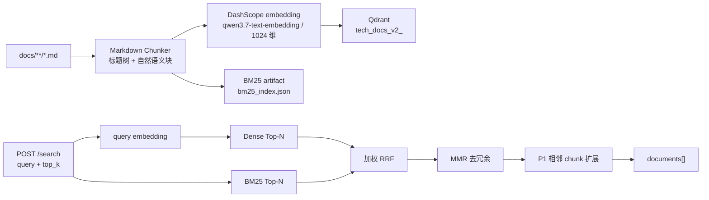
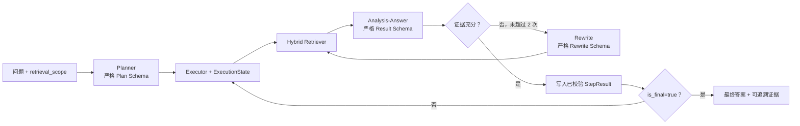

# RAG 链路

本文记录两条相互隔离的 RAG 链路的实际调用合同、输入输出、数据流和已知边界：技术文档 RAG V2 只索引 `docs/**/*.md`，OPERA-style Multi-Agent RAG 只索引 HotpotQA paragraph。两者都不索引 `app/` 下的业务源码，也不共享 collection、artifact 或评测指标。

## 1. 当前能力与入口

当前已实现的完整链路如下：



| 组件 | 实际入口 | 输入 | 输出 |
| --- | --- | --- | --- |
| 离线索引 | `app/ragservice/embedding-service/rag_index/offline_runner.py` | `docs/**/*.md`、环境变量、检索 YAML | Qdrant collection、manifest、BM25 artifact |
| 在线检索 | `app/ragservice/embedding-service/main.py` | HTTP `POST /search` | `documents` 字符串数组 |
| Go 调用方 | `app/ai/rpc/internal/ragservice/rag.go` | 用户问题、Top-K | `[]string`，由旧 Chat 继续使用 |
| 离线评测 | `app/ragservice/embedding-service/rag_index/evaluation.py` | JSONL 标注集 | Dense 与 Hybrid 指标 JSON |
| 非敏感参数 | `app/ragservice/config/rag-retrieval.yaml` | YAML | BM25、RRF、MMR 的运行参数 |
| OPERA 离线索引 | `app/ragservice/embedding-service/opera/hotpot_runner.py` | HotpotQA distractor JSON、环境变量、检索 YAML | 独立 Qdrant collection、`out/opera-index` manifest、BM25 artifact |
| OPERA 在线编排 | `main.py` → `opera/executor.py` | HTTP `POST /opera/ask` | 经多 Agent 闭环得到的答案、最终证据引用与步骤数 |

## 1.1 Multi-Agent Multi-hop RAG 技术设计（OPERA-style）

本节是面向 HotpotQA 与面试演示的 **Multi-Agent Multi-hop RAG** 技术设计。它复用当前 Hybrid Retriever，不替换为 BGE-M3 或 FAISS；旧 Chat 和当前技术文档 RAG V2 保持独立、继续使用原有 `/search` 合同。

这里的两个概念必须区分：

- **Multi-Agent**：中心化 Planner、Analysis-Answer、Rewrite 三个职责分离的 Agent，以及唯一负责状态写入和调度的 Executor。不是多个模型自由对话，而是受结构化合同约束的工作流。
- **Multi-hop**：Planner 将复杂问题拆成有依赖的子目标；后续子目标读取已校验的前序 `StepResult`，再触发下一次检索和分析。一个比较、因果或实体链路问题至少经过“前序事实 → 依赖前序事实的最终推导”两跳，而不是一次检索后直接生成答案。

### 实施状态与边界

| 阶段 | 状态 | 交付内容 |
| --- | --- | --- |
| 检索底座 | 已完成 | HotpotQA paragraph 导入、独立版本化 collection、`case/all` Dense + BM25 + RRF + MMR、单次分词与 case BM25 LRU。 |
| 多 Agent 闭环 | 已完成真实 smoke test，尚未形成离线评测指标 | `ExecutionState`、Planner、Analysis-Answer、Rewrite、DeepSeek Responses JSON Schema/Pydantic、`POST /opera/ask`；已将 7,405 个 HotpotQA case、73,700 个 paragraph 全量写入 DashScope/Qdrant，并以 `case` scope 实际调用 DeepSeek 完成和诊断多跳链路。 |
| 观测与评测 | Langfuse 与本地执行轨迹已验证；正式评测待实现 | Langfuse prompt/version/token/cost trace、retriever 正文输出和安全 provider 诊断已验证；当前没有可执行的 HotpotQA Hybrid 基线 vs OPERA-style 双组评测器，因此没有可报告的召回或答案指标。 |
| Context / Memory | 明确后置 | 不纳入当前请求状态；需要单独定义持久化、召回和隐私边界。 |

当前已完成第一阶段的本地代码：`opera.hotpot_runner` 将 `docs/hotpotQA/hotpot_dev_distractor_v1.json` 的每个 `context` 元素导入为一个 paragraph chunk，并写入独立的 `hotpot_distractor_v1_<index_version>` collection 与 `out/opera-index/` artifact。index version 同时绑定显式的 Hotpot 导入合同版本，当前 checkpoint/20 条批量导入会创建新的 collection，不复用历史 partial collection。artifact 只分词一次，运行时可由同一份 token 使用全库 BM25 或按 `case_id` 按需构建、LRU 缓存的单题 BM25；不会将 `answer`、`supporting_facts` 写入运行时索引。

`/opera/ask`、Planner、Analysis-Answer、Rewrite 和 DeepSeek Responses 的结构化调用已完成本地实现。每个 Agent 同时受远端 JSON Schema、本地 Pydantic 和 Executor 上下文校验；mock 测试覆盖 Schema 修复一次、伪造证据拒绝、最终步骤来源与 HTTP scope 校验。Langfuse 已接入同一条请求树：根 `opera-ask`、三个 Agent、Hybrid Retriever 和每次 Responses generation 均为正确类型的嵌套 observation。2026-09-01 已完成 HotpotQA dev distractor 全量导入：7,405 个 case、73,700 个 paragraph 均完成 DashScope embedding、Qdrant 写入、checkpoint 和 BM25 artifact 核验；当前版本为 `f2745236b78afab54b6bd9a2055588e77b9e2339a3198484ea3355f81c8c4484`。

2026-09-02 已完成真实 DeepSeek `case` scope smoke test。它验证了 Planner → Retriever → Analysis-Answer → Rewrite 的实际嵌套 trace、JSON Schema/Pydantic 校验和本地 `out/opera-traces/<run_id>.json` 诊断产物。已观察到三类真实结果：`completed`、证据不足时的 `insufficient`，以及 provider 只返回 reasoning 且达到 `max_output_tokens` 时的 `ResponseOutputTextError`。后者目前仍经 `ValueError` 映射为 HTTP `400`，语义上应在后续改为 provider 不可用类错误；在修复前，调用方不能把这类 `400` 当成纯粹的用户输入错误。

多 Agent 编排阶段只实现 OPERA 风格的三类 Agent：中心化 Planner、Analysis-Answer、Rewrite。它不是逐字复刻 OPERA 论文，而是保留“规划 → 检索分析/回答 → 必要时改写”的多跳闭环，并使用本项目已验证的 Dense + BM25 → RRF → MMR 检索链路。



### Agent 职责与限制

| Agent / 组件 | 输入 | 必须输出 | 不能做什么 |
| --- | --- | --- | --- |
| Planner | 原始问题、可用检索范围 | 最多 4 个有依赖关系的子目标，最后一个必须 `is_final=true` | 不自行回答、不伪造证据、不直接写状态 |
| Hybrid Retriever | 已解析的子目标或 Rewrite query、`case` / `all` 范围 | paragraph 候选及稳定 ID | 不读取答案标注、不跨越调用方明确的范围 |
| Analysis-Answer | 当前子目标、已通过的前序结果、候选 paragraph | 有证据的子答案或 `insufficient`、证据句 ID | 不直接修改 `ExecutionState`、不得把检索文本当系统指令 |
| Rewrite | 原子子目标、当前检索 query、已验证前序答案、失败原因、本轮不可信 paragraph 候选 | 一个改写 query | 不新增步骤、不改变检索范围；不得将候选 paragraph 当作已验证事实 |
| Executor | Plan、Agent 的已校验响应 | 更新运行态，调度下一步 | 不允许 Agent 直接写运行态 |

不增加 Final Agent。计划中唯一 `is_final=true` 的最后子目标由 Analysis-Answer 直接产生最终答案；比较、计数、归纳等任务需要由 Planner 显式生成一个依赖前序结果的最终推导子目标，不能仅取最后一个检索答案。

### `ExecutionState`

`ExecutionState` 是单个请求的短生命周期运行态，不是数据库 Memory，也不是 Agent 对话历史。它由 Executor 创建并独占写入：

```text
ExecutionState
├── run_id
├── question
├── retrieval_scope                 # case 或 all
├── plan                            # 已通过 Schema 校验的 Plan
├── step_results[step_id]           # 已通过校验的 StepResult
├── rewrite_count_by_step[step_id]
└── status
```

`StepResult` 至少含状态、子答案、`chunk_id`、证据句 ID、模型用量和耗时。Executor 只有在 Analysis-Answer 的返回同时通过 JSON Schema 与本地模型校验后才写入该结构；下游 Agent 只读取这些结构化且已接受的前序结果。第一阶段按依赖关系串行执行，不做并行分支，避免共享状态竞争。请求完成后销毁该对象，只保留脱敏的运行指标和可选评测产物；未来 Context 或 Memory 不得自动复用本对象，必须另行定义持久化边界。

### 严格结构化输出

prompt 中的格式说明只用于帮助模型理解，不能作为可信边界。每个 Agent 调用都必须同时使用以下两层约束：

1. 使用 DeepSeek Responses API 的 JSON Schema 输出格式，拒绝 Schema 外字段，并声明固定的 schema name。
2. 收到响应后，使用本地 Pydantic 模型再次执行 `model_validate_json`；模型设置 `extra=forbid`，并校验步骤数、依赖关系、`is_final`、证据 ID 和改写次数。

最小 Schema 合同如下：

| 调用 | 关键字段 |
| --- | --- |
| Planner | `steps[]`、`step_id`、`subgoal`、`depends_on[]`、`is_final` |
| Analysis-Answer | `status`、`answer`、`evidence[]`（`chunk_id`、`sentence_index`）、`needs_rewrite`、`failure_reason`；五个字段都必须显式返回，`answer` / `failure_reason` 可为 `null`，`evidence` 可为 `[]`。 |
| Rewrite | `rewritten_query`、`reason` |

任一层校验失败时，Executor 只用固定修复指令重试一次；仍失败则将该步骤标记为失败并安全结束本次请求，不把未经验证的文本当答案或状态更新。`max_repair_attempts` 由 `rag-retrieval.yaml` 的 `opera.schema_validation` 配置。

### Prompt、成本与 Langfuse

本地 fallback prompt 存放在 `app/ragservice/embedding-service/opera/prompts/`，按 Agent 分为 `planner_system.md`、`analysis_answer_system.md`、`rewrite_system.md`。三份都属于无变量的 Langfuse `text` prompt；对应名称固定为 `opera-planner-system`、`opera-analysis-answer-system`、`opera-rewrite-system`，由 `python -m opera.prompt_sync` 显式创建或发布为 `production` label。运行时优先按该 label 获取 prompt，并按 YAML 缓存 TTL 缓存；关闭 Langfuse、配置缺失、远端不可达或远端内容校验失败时，回退本地文件，并记录 `prompt_source=local_fallback`。

Langfuse 记录 `run_id`、Agent 名称、prompt 名称/版本、Schema、思考强度、输入/缓存/输出 token、耗时、错误类型和估算成本。仓库默认 `capture_input_output=false`：不向 Langfuse 上传用户问题、检索 query、paragraph 正文或模型输出，仅保留字符数摘要。只有在本地、确认数据不敏感的排障场景，才可临时改为 `true` 并重启 FastAPI 服务；完成排障后应恢复为 `false`。每个请求还会在 `out/opera-traces/<run_id>.json` 写入本地 v2 调试轨迹：其中包含 Plan、每次实际 query、完整 retrieved paragraph、Analysis/Rewrite 结构化结果、最终响应，或不含原始 provider 错误正文的 provider 状态诊断。

当前模型为 `deepseek-v4-flash`，所有 Agent 明确传入 DeepSeek Responses API 的 `reasoning.effort=low`。思考 token 与最终 JSON Schema 文本共用 `max_output_tokens` 上限，因此 `low` 不等于不消耗 reasoning token，也不能保证一定产生最终文本。当前软限制为 Planner `2000`、Analysis-Answer `2000`、Rewrite `3000`；三者与超时、最大步骤数、最大改写次数和 Langfuse 缓存 TTL 都统一位于 `app/ragservice/config/rag-retrieval.yaml` 的 `opera` 节。修改 YAML 后必须重启 FastAPI 服务，运行中的 client 不会热加载配置。

当前 OPERA 模型为 `deepseek-v4-flash`。Langfuse 自定义模型用 `(?i)^deepseek-v4-flash$` 与 generation 的 `model` 精确匹配，单位为 `TOKENS`，默认层名为 `Peak conservative`。它采用 DeepSeek 高峰价作为成本上界，三个互斥 usage key 的价格（USD/token）为：

| usage key | DeepSeek 对应计费项 | 高峰价（元/百万 token） | Langfuse 价格（USD/token） |
| --- | --- | ---: | ---: |
| `input` | 缓存未命中输入 | `3.0` | `0.00000044637` |
| `cache_read_input_tokens` | 缓存命中输入 | `0.10` | `0.000000014879` |
| `output` | 输出 | `9.0` | `0.00000133911` |

换算使用 `2026-08-28` 的 `1 CNY = 0.14879 USD`；DeepSeek 价格或汇率改变时，需要同时更新 Langfuse 模型定义和本表。代码先从 `input` 扣除 cache read token，再单独上报 `cache_read_input_tokens`，不会重复计费。

### HotpotQA 数据、切分与评测边界

HotpotQA distractor 的一个 `context` 元素 `[title, sentences[]]` 是一个候选 paragraph，而不是若干独立句子。第一阶段每个 paragraph 生成一个 chunk：embedding 输入为 `Title + 完整 sentences 拼接文本`，payload 保留原始句子和 `sentence_index` 用于证据定位。

全局 collection 可保存所有题目的 paragraph，但 `retrieval_scope=case` 时查询必须以 `case_id` 过滤，因此仅在该题自己的 10 个候选 paragraph 中竞争；`retrieval_scope=all` 预留给全库检索实验。两者是不同实验条件：distractor 指标与全库闭域检索指标必须分开报告。

`case` 是评测器使用的内部范围：评测程序从 HotpotQA 原始记录读取 `_id` 后传入 `case_id`，普通用户不需要、也不应手工输入该 ID。面试演示或自由提问接口默认使用 `all`；系统不能根据问题文本猜测 `case_id`，否则会把官方 distractor 条件与全库检索混在一起。

验收仅保留两组：

1. 当前 Hybrid Retriever 基线。
2. 在相同检索语料与范围下运行的 OPERA-style 闭环。

离线评测才能读取 `answer`、`supporting_facts` 等 HotpotQA 标注；导入器、Retriever 和 Agent 运行时都不得读取它们。评测与运行生成物写入 `out/<task>/`，不得提交。

截至当前版本，HotpotQA 的正式双组评测器尚未实现，不能使用 `rag_index.evaluation` 替代：后者针对 Markdown RAG V2 的 `Dense` vs `Hybrid` JSONL 合同，不能发起 `/opera/ask`，也不能衡量多跳回答。后续 OPERA 评测器必须固定在 `retrieval_scope=case`，并独立报告支持 paragraph 覆盖、答案 EM/F1、`completed/insufficient/error` 分布、步骤数、Rewrite 次数、token 与成本；`all` 范围只能作为另一组全库实验，不得与 distractor 指标混报。

### Hotpot embedding 批量与恢复

`opera.hotpot_runner` 默认对 `qwen3.7-text-embedding` 每次请求 20 个 paragraph，这是该模型的 provider 上限；已有的 `--embedding-batch-size` 仍可用于显式覆盖，但已知模型会在发请求前校验上限，不能设置为 50。该值是离线执行参数，不写入 YAML，也不改变 paragraph 切分边界。

真实导入的 source → transform → sink 如下：Hotpot 索引计划的有序 `records` 是 source；每批 provider embedding 后同步 `upsert(wait=True)` 到新版本的 Qdrant collection；确认成功后，将恢复游标和最后批次的记录指纹写入 `out/opera-index/<collection_prefix>/<index_version>/embedding-checkpoint.json`。该指纹由 `chunk_id`、point ID 与输入摘要计算而来；checkpoint 不写正文、向量、用户问题或密钥。

该 JSON 是固定大小的状态机，而不是 73,700 行表：`next_uncompleted_start` 直接指向下一个批次。重启相同命令时，Executor 只按最多 20 个确定性 point ID 回读该未确认批次；存在且 payload 的 `index_version`、`embedding_input_hash` 均匹配时，跳过重复 embedding。若 provider 已接受请求但客户端因网络问题没有响应，无法验证 provider 侧幂等性，因此这一批最多会被重新计费一次。

## 2. 运行前配置

### 2.1 必要服务

Qdrant 是唯一需要本地启动的中间件。Docker 数据使用 named volume `ai-chat-qdrant-data`，不会写入项目的 `out/`：

```powershell
docker compose -f .\deploy\rag\docker-compose-qdrant.yaml up -d
```

Python 命令统一在 Conda 环境 `aiChatRAG` 中执行：

```powershell
conda run -n aiChatRAG python -m pip install -r .\app\ragservice\embedding-service\requirements.txt
```

### 2.2 `.env`：密钥与正在使用的索引版本

项目根目录 `.env` 至少需要以下字段，且该文件不能提交：

```dotenv
DASHSCOPE_API_KEY=your_dashscope_api_key
RAG_INDEX_VERSION=<successful_index_version>
OPERA_INDEX_VERSION=<successful_hotpot_index_version>
DEEPSEEK_API_KEY=your_deepseek_api_key
```

可选配置及默认值如下：

| 配置 | 默认值 | 用途 |
| --- | --- | --- |
| `RAG_EMBEDDING_BASE_URL` | `https://dashscope.aliyuncs.com/compatible-mode/v1` | DashScope OpenAI-compatible base URL |
| `RAG_EMBEDDING_MODEL` | `qwen3.7-text-embedding` | query 与离线 chunk 共用的 embedding 模型 |
| `RAG_EMBEDDING_DIMENSIONS` | `1024` | embedding 向量维度，必须与 collection 一致 |
| `QDRANT_HOST` | `localhost` | Qdrant 主机 |
| `QDRANT_GRPC_PORT` | `6334` | Qdrant gRPC 端口 |
| `RAG_DENSE_TOP_K_MAX` | `10` | `/search` 的 `top_k` 最大值 |
| `RAG_P1_NO_EXPAND_THRESHOLD` | `800` | 核心命中达到该 token 数时不做 P1 扩展 |
| `RAG_P1_CONTEXT_TOKEN_BUDGET` | `1200` | 每个核心命中加 P1 邻居的总 token 预算 |
| `OPERA_INDEX_VERSION` | 无，`/opera/ask` 必填 | 已完成 HotpotQA 导入的版本；与 V2 的 `RAG_INDEX_VERSION` 相互独立。 |
| `DEEPSEEK_API_KEY` | 无，`/opera/ask` 必填 | OPERA 三个 Agent 的 DeepSeek Responses 调用凭据。 |
| `DEEPSEEK_BASE_URL` | `https://api.deepseek.com` | DeepSeek Responses API 的 base URL。 |
| `LANGFUSE_PUBLIC_KEY`、`LANGFUSE_SECRET_KEY`、`LANGFUSE_BASE_URL` | 无，可选 | 用于 OPERA prompt 版本与 trace；缺失或不可用时自动回退本地 prompt，不阻断请求。 |

`RAG_INDEX_VERSION` 和 `OPERA_INDEX_VERSION` 都必须显式指定，服务不会猜测“最新版本”。两者的值各自来自相应 manifest 首行；版本是“切分合同 + embedding 模型/维度 + 全部 embedding 输入”的 SHA-256 摘要，不是创建时间，也不能互换。

### 2.3 `rag-retrieval.yaml`：可调的检索参数

当前配置为：

```yaml
collection_prefix: tech_docs_v2

bm25:
  candidate_top_k: 15
  tokenizer_version: jieba-identifier-v1

rrf:
  rank_constant: 20
  dense_weight: 1.0
  bm25_weight: 0.005

mmr:
  lambda: 0.7
```

| 字段 | 作用 | 修改后的操作 |
| --- | --- | --- |
| `collection_prefix` | 与 `index_version` 组成 collection 名称，例如 `tech_docs_v2_<index_version>` | 必须重新构建索引 |
| `bm25.tokenizer_version` | BM25 分词合同 | 必须重新构建索引 |
| `bm25.candidate_top_k` | Dense 与 BM25 各自送入 RRF 的候选数，必须不小于 `RAG_DENSE_TOP_K_MAX` | 重启服务，并重新评测 |
| `rrf.*` | 两路候选按排名融合的常数和权重 | 重启服务，并重新评测 |
| `mmr.lambda` | 相关性与去重之间的权重，范围为 `(0, 1]` | 重启服务，并重新评测 |

OPERA 的运行参数与 V2 参数放在同一份 YAML，但索引前缀、检索 scope 和 Agent 输出预算独立：

| YAML 字段 | 当前值 | 作用 |
| --- | ---: | --- |
| `opera.retrieval.collection_prefix` | `hotpot_distractor_v1` | OPERA 专用 Qdrant collection 前缀；变更后必须重新导入 HotpotQA。 |
| `opera.retrieval.default_scope` | `case` | 评测默认范围；HTTP 调用仍必须显式传 `case` 或 `all`。 |
| `opera.retrieval.top_k` | `3` | 每步 Hybrid Retriever 的默认候选数。 |
| `opera.max_steps` | `4` | Planner 可产生的最大子目标数；最后一个必须为最终目标。 |
| `opera.max_rewrites` | `2` | 每个步骤最多两次 Rewrite。 |
| `opera.model.reasoning_effort` | `low` | 三个 Agent 显式使用的 DeepSeek Responses 思考强度；可选 `none`、`low`、`high`、`max`。 |
| `opera.agents.planner.max_output_tokens` | `2000` | Planner 单次 Responses 输出 token 的软上限。 |
| `opera.agents.analysis_answer.max_output_tokens` | `2000` | Analysis-Answer 单次 Responses 输出 token 的软上限。 |
| `opera.agents.rewriter.max_output_tokens` | `3000` | Rewrite 单次 Responses 输出 token 的软上限。 |
| `opera.schema_validation.max_repair_attempts` | `1` | Schema 或本地 Pydantic 校验失败后的固定修复次数。 |
| `opera.langfuse.capture_input_output` | `false` | 默认不向 Langfuse 上报原文；仅本地、非敏感排障时临时设为 `true` 并重启服务。 |

## 3. 离线索引：输入、处理与产物

### 3.1 输入与切分规则

离线入口只递归读取 `docs/**/*.md`。每个文档按完整可变深度 Markdown 标题栈切为标题区间；标题等级不要求连续。fenced code block 内的 `#` 不会被当成标题。

一个标题区间内的正文、列表、表格、引用和 fenced code block 会先作为自然语义块处理：

- 目标大小为 800 token；到达目标时优先在自然块边界落块。
- 单个“标题路径 + 正文”的 embedding 输入硬上限为 1200 token。
- 一个自然块本身超过硬上限时，正文/引用优先按句末切；代码、列表和表格优先按行切；只有单句或单行仍超限时才退化为硬切分。
- 单独的 `[TOC]`、`[[TOC]]`、空白和少量明确的 Markdown TOC 控制标记不会产出 chunk。
- 一个超长标题区间产生多个 chunk 时，每个 chunk 都重复完整标题路径；因此离开原文位置后仍保留章节语义。

其中 token 计数使用 `cl100k_base` 作稳定工程估算，并不是 Qwen 服务端精确 tokenizer 计数；800/1200 是当前策略阈值，后续应继续由标注评测集校准。

### 3.2 调用命令

先执行 dry-run。该命令只切分、写本地预览产物，不调用 embedding API，也不写 Qdrant：

```powershell
Set-Location .\app\ragservice\embedding-service
conda run -n aiChatRAG python -m rag_index.offline_runner --dry-run
```

确认 manifest 后，再执行真实索引：

```powershell
Set-Location .\app\ragservice\embedding-service
conda run -n aiChatRAG python -m rag_index.offline_runner
```

常用可选参数：

```powershell
conda run -n aiChatRAG python -m rag_index.offline_runner `
  --docs-dir ..\..\..\docs `
  --output-dir ..\..\..\out\rag-index `
  --embedding-batch-size 10
```

`--docs-dir` 默认项目根目录 `docs`，`--output-dir` 默认项目根目录 `out/rag-index`，`--embedding-batch-size` 默认 10。`--soft-limit-tokens` 和 `--hard-limit-tokens` 的默认值分别为 800 和 1200；它们属于索引合同，变更后会得到新的 `index_version` 与独立 collection。

### 3.3 离线输出

真实运行只有在所有 embedding 已写入 Qdrant、point 数量核对成功后，才写入本地产物：

```text
out/rag-index/
└── tech_docs_v2/
    └── <index_version>/
        ├── manifest.jsonl
        └── bm25_index.json
```

同时创建独立的 Qdrant collection：

```text
tech_docs_v2_<index_version>
```

旧 collection 不会被覆盖或删除。`manifest.jsonl` 首行是本次版本、模型、维度、阈值和 chunk 总数；后续每一行是一条 chunk 的 Qdrant point 与 payload。每个 payload 包含：

| 字段 | 用途 |
| --- | --- |
| `document_id` | 由 docs 相对路径生成的稳定文档 ID，用于限制同一文件内的关系判断 |
| `section_id` | 完整当前标题路径的稳定 ID，用于识别同一标题区间 |
| `parent_section_id` | 直接父标题的 `section_id`；同文档、同 parent 的兄弟标题可参与 P1 |
| `chunk_id`、`chunk_order` | 业务唯一 ID 与文档内连续顺序；后者用于定位真实前后块 |
| `heading_path` | 完整标题路径，既提供 embedding 上下文，也用于渲染给 Chat |
| `text`、`line_start`、`line_end` | 原文及其行号，供最终参考资料追溯 |
| `content_hash`、`embedding_input_hash` | 分别标识正文与“标题路径 + 正文”是否改变 |
| `previous_chunk_id`、`next_chunk_id` | 同一 `section_id` 内超长切分产生的前后叶子块关系 |
| `token_count`、`has_code` | P1 token 预算与代码块调试元数据 |
| `index_version` | 强制 Qdrant、manifest、BM25 artifact 属于同一次索引批次 |

embedding 的实际输入文本为：

```text
标题路径：一级标题 > 二级标题 > 当前标题

正文：
<chunk 正文；包含紧邻的 fenced code block 时一并包含>
```

## 4. 在线检索：HTTP 调用方式与输出

### 4.1 启动与健康检查

在 `.env` 已设置成功的 `RAG_INDEX_VERSION`、Qdrant 已启动且对应 BM25 artifact 存在时，启动服务：

```powershell
Set-Location .\app\ragservice\embedding-service
conda run -n aiChatRAG python -m uvicorn main:app --host 127.0.0.1 --port 8082
```

健康检查只代表 HTTP 进程可达，不会读取索引或调用 embedding：

```powershell
Invoke-RestMethod -Uri http://127.0.0.1:8082/health
```

预期输出：

```json
{"status":"ok","service":"rag-v2"}
```

### 4.2 `POST /search`

请求体：

```json
{
  "query": "Golang 中变量什么时候发生逃逸？",
  "top_k": 3
}
```

PowerShell 调用示例：

```powershell
$body = @{ query = "Golang 中变量什么时候发生逃逸？"; top_k = 3 } | ConvertTo-Json
Invoke-RestMethod `
  -Method Post `
  -Uri http://127.0.0.1:8082/search `
  -ContentType "application/json" `
  -Body $body
```

输入约束：

- `query`：必填、去除空白后不能为空、最大 1000 个字符。
- `top_k`：可选，默认 3；必须是 `1` 到 `RAG_DENSE_TOP_K_MAX`（当前默认 10）的整数。它表示 RRF/MMR 后保留的核心命中数，而不是最终拼接的 chunk 数。

成功响应：

```json
{
  "documents": [
    "标题路径：…\n来源行：…\n\n正文：\n…",
    "标题路径：…\n来源行：…\n\n正文：\n…"
  ]
}
```

`documents` 的每项对应一个核心命中形成的上下文组。每个组先含核心 chunk，P1 允许时最多追加其文档顺序中实际存在的前一个和后一个 chunk；组内按原文顺序渲染，多个 chunk 以 `---` 分隔。响应刻意不返回 embedding、Qdrant point ID、内部检索分数或 API key。

在线检索顺序为：

1. 将 query 调用一次 Qwen embedding，生成 1024 维 query 向量。
2. 从指定 collection 做 Dense Top-N，并用同一个 query 做 BM25 Top-N。
3. 使用 YAML 中的加权 RRF 合并两路 `chunk_id` 排名。
4. 读取 RRF 候选向量，用 MMR 选出 `top_k` 个去重后的核心命中。
5. 对每个核心命中执行 P1 上下文扩展，再渲染为 `documents`。

P1 的精确规则：核心 chunk 的 `token_count >= 800` 时不扩展；否则只读取文档内确实存在的 `chunk_order - 1` 和 `chunk_order + 1`。候选需满足“同文档且同 `section_id`”或“同文档且同非空 `parent_section_id`”，并且加入后单个上下文组不得超过 1200 token。文档开头或结尾没有相邻块时，不会查询不存在的 ID；不会跨文档或跨父标题扩展。

### 4.3 `POST /opera/ask`

`/opera/ask` 是与 `/search` 并列的独立接口，供 HotpotQA 评测和面试演示使用；它不会改变旧 Chat 的 `/search` 合同，也不会由当前 Go Chat 自动调用。

输入请求体：

```json
{
  "question": "<multi-hop question>",
  "retrieval_scope": "all",
  "top_k": 3
}
```

| 字段 | 是否必填 | 约束与含义 |
| --- | --- | --- |
| `question` | 是 | 最大 1000 字符，作为本次短生命周期 `ExecutionState` 的原始问题。 |
| `retrieval_scope` | 是 | 只能是 `case` 或 `all`；所有查询都必须明确声明范围。 |
| `case_id` | 条件必填 | `scope=case` 时必须是 HotpotQA 原始记录的 `_id`；`scope=all` 时必须省略。普通用户与面试演示使用 `all`，只有评测器从数据集读取 `_id` 后才使用 `case`。 |
| `top_k` | 否 | 每次 Hybrid Retriever 的候选数，默认 3，范围 1 到 10。 |

该接口的 source → transform → sink 为：请求体进入 `ExecutionState`；Planner 产生受 Schema 约束的 Plan；Executor 逐个调度 Hybrid Retriever 与 Analysis-Answer，必要时每个步骤最多两次 Rewrite；仅当最后子目标 `is_final=true` 的 Analysis-Answer 通过双重校验后，才将其写入 HTTP 响应。运行时不读取 HotpotQA 的 `answer` 与 `supporting_facts` 标注。

评测范围调用示例：

```powershell
$body = @{
  question = "<question from HotpotQA>"
  retrieval_scope = "case"
  case_id = "<HotpotQA _id>"
  top_k = 3
} | ConvertTo-Json
Invoke-RestMethod `
  -Method Post `
  -Uri http://127.0.0.1:8082/opera/ask `
  -ContentType "application/json" `
  -Body $body
```

成功响应：

```json
{
  "run_id": "<uuid>",
  "status": "completed",
  "answer": "<answer produced by the final planned subgoal>",
  "final_evidence": [
    {"chunk_id": "<case_id>:<paragraph_index>", "sentence_index": 0}
  ],
  "completed_step_count": 2
}
```

`final_evidence` 只引用最终回答实际使用的 paragraph 与句子位置，不返回 paragraph 正文、向量、内部得分或模型原始输出。请求约束、Schema/Pydantic 校验失败，以及当前的 `ResponseOutputTextError` 都返回 `400`；`OPERA_INDEX_VERSION`、DeepSeek 连接、DashScope、Qdrant 或本地 BM25 artifact 不可用时返回 `503`。其中 provider 的空文本/不完整输出映射为 `400` 是已知待修正的错误分类问题。`/health` 只代表 HTTP 进程可达，不能作为 OPERA 索引或 provider 已就绪的证明。

### 4.4 与 Go Chat 的衔接

`app/ai/rpc/internal/ragservice/rag.go` 使用相同的 JSON 合同：

```go
type SearchRequest struct {
    Query string `json:"query"`
    TopK  int    `json:"top_k"`
}

type SearchResponse struct {
    Documents []string `json:"documents"`
}
```

因此 RAG V2 没有改变旧 Chat 的调用格式。Go 客户端当前为 RAG HTTP 请求设置 5 秒超时；RAG 侧不会将用户 query 或文档正文写入日志。

## 5. 评测：只对比两条链路

评测只比较以下两组，不把 Dense、BM25、RRF、MMR 拆成四种模式：

1. `Dense`：朴素向量召回基线。
2. `Hybrid`：`Dense + BM25 → 加权 RRF → MMR` 的完整核心召回链路。

同一题只调用一次 query embedding，该向量被 Dense 基线和 Hybrid 复用。P1 是命中后的上下文组装，不参与 HitRate/MRR 的核心召回排名计算。

评测集为 JSONL，每行至少要有 `case_id`、`query`，以及以下二选一的相关答案标记：

```json
{"case_id":"escape-01","query":"…","target_chunk_id":"<chunk_id>"}
```

或：

```json
{"case_id":"escape-02","query":"…","relevant_chunks":[{"chunk_id":"<chunk_id>"}],"stress_type":"semantic"}
```

运行：

```powershell
$env:RAG_INDEX_VERSION = "<successful_index_version>"
Set-Location .\app\ragservice\embedding-service
conda run -n aiChatRAG python -m rag_index.evaluation `
  --eval-set <path-to-eval-set.jsonl> `
  --top-k-max 10
```

输出写入：

```text
out/rag-eval/<index_version>/<dataset>-dense-vs-hybrid.json
```

结果包含 `HitRate@1/3/5/10`、`MRR@10`、按 `stress_type` 的分组、评测集 SHA-256、本次 `index_version`、collection、embedding 模型和 YAML 参数；不写入 query、文档正文、向量或密钥。

当前 24 题校准集上的调优结果是：Dense 的 MRR@10 为 `0.8507`，最终 Hybrid 为 `0.8542`；Hybrid 的 HitRate@3 从 `0.8750` 提升到 `0.9167`。该评测集已经参与过参数调优，只能说明校准集改善，必须再用一份未参与调参、尤其包含词法命中与语义改写问题的保留集确认泛化效果。

## 6. 已处理的问题、保护措施与排查方向

| 问题 | 当前处理方式 | 开发时仍需注意 |
| --- | --- | --- |
| 在 1200 token 处机械截断会破坏语义 | 先按标题、自然块、句末/行边界切；仅单句或单行超限时才硬切 | 超长代码行或没有句末的超长文本仍会退化切分，应通过 manifest 抽查 |
| 不同标题下的短 chunk 缺上下文 | P1 只读取真实前后邻居，并允许同 section 或同直接父标题的兄弟 section | P1 不是无限扫描父标题下所有 chunk，最多只考虑前后两个；这避免大章节放大延迟 |
| 旧版本 point 被新批次覆盖 | 每个 `index_version` 使用独立 collection，而不是同 collection 覆盖 point | 新版本占用新存储；旧 collection 的清理由人工明确授权后再做 |
| Qdrant 与本地 BM25 数据错配 | 服务启动时校验维度、版本、collection、分词版本及完整 `chunk_id` 集合 | 切换 `RAG_INDEX_VERSION` 时，必须同时保留同版本 `bm25_index.json` |
| 未指定版本会混用不同 embedding/切分批次 | `RAG_INDEX_VERSION` 缺失时 `/search` 返回 503，不选择“最新” | 新建索引成功后，要人工更新 `.env` 并重启服务 |
| RRF/MMR 参数写死，无法评测调整 | 参数独立放在 YAML | 只改候选数/RRF/MMR 后必须重启服务；不要只凭直觉固定生产参数 |
| RAG 日志泄露用户问题或文档正文 | 索引、检索和评测日志仅记录版本、数量、耗时和错误类型 | 新增日志时不得加入 API key、query、正文、向量或完整 payload |
| `/health` 通过但索引不可用 | `/health` 仅检查进程；真实索引校验在首个 `/search` 创建服务时执行 | 上线后应至少用一条非敏感测试 query 验证 `/search` |
| Qwen 与 `cl100k_base` token 计数不完全一致 | 800/1200 作为本地稳定估算，而非服务端绝对上限 | 若供应商窗口、模型或 tokenizer 更换，需 dry-run、重新索引和评测 |

常见 HTTP 错误：

| 状态码 | 情况 | 优先检查 |
| --- | --- | --- |
| `400` | 空 query、query 超过 1000 字符，或 `top_k` 越界 | 请求体和 `RAG_DENSE_TOP_K_MAX` |
| `503` | 未设置 `RAG_INDEX_VERSION` | 项目根目录 `.env` 是否配置成功版本 |
| `503` | embedding、Qdrant、collection 或 BM25 artifact 不可用/不匹配 | Qdrant 容器、模型配置、`out/rag-index/.../bm25_index.json`、对应版本 collection |

## 7. 当前未实现的范围

- rerank 尚未接入；当前 P1 的第 2 优先级不使用 rerank，只按已确认的相邻与标题关系规则扩展。
- Langfuse 仅接入 OPERA 的 Agent、Retriever 和 Responses；旧 `/search`、embedding 离线构建与旧 Chat 尚未接入。
- 旧 Chat 已可调用本服务；RAG 服务不承担项目源码检索。
- 删除旧 collection、迁移旧 `tech_docs` 数据不属于自动化流程，避免误删历史索引。
