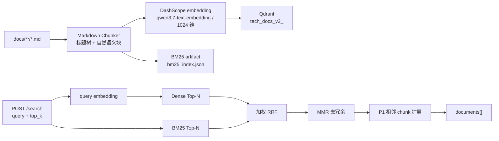

# RAG V2 开发文档

本文记录当前技术文档 RAG 的实际调用合同、输入输出、数据流和已知边界。它只覆盖 `docs/**/*.md` 的技术文档检索；不索引 `app/` 下的业务源码，也不等同于未来 Coding Agent 的源码检索或长期记忆。

## 1. 当前能力与入口

当前已实现的完整链路如下：



| 组件 | 实际入口 | 输入 | 输出 |
| --- | --- | --- | --- |
| 离线索引 | `app/ragservice/embedding-service/rag_index/offline_runner.py` | `docs/**/*.md`、环境变量、检索 YAML | Qdrant collection、manifest、BM25 artifact |
| 在线检索 | `app/ragservice/embedding-service/main.py` | HTTP `POST /search` | `documents` 字符串数组 |
| Go 调用方 | `app/ai/rpc/internal/ragservice/rag.go` | 用户问题、Top-K | `[]string`，由旧 Chat 继续使用 |
| 离线评测 | `app/ragservice/embedding-service/rag_index/evaluation.py` | JSONL 标注集 | Dense 与 Hybrid 指标 JSON |
| 非敏感参数 | `app/ragservice/config/rag-retrieval.yaml` | YAML | BM25、RRF、MMR 的运行参数 |

## 2. 运行前配置

### 2.1 必要服务

Qdrant 是唯一需要本地启动的中间件。Docker 数据使用 named volume `ai-chat-qdrant-data`，不会写入项目的 `out/`：

```powershell
docker compose -f .\deploy\rag\docker-compose-qdrant.yaml up -d
```

Python 命令统一在 Conda 环境 `aiChatRAG` 中执行：

```powershell
conda run -n aiChatRAG python -m pip install -r .\app\ragservice\embedding-service\requirements.txt
```

### 2.2 `.env`：密钥与正在使用的索引版本

项目根目录 `.env` 至少需要以下字段，且该文件不能提交：

```dotenv
DASHSCOPE_API_KEY=your_dashscope_api_key
RAG_INDEX_VERSION=<successful_index_version>
```

可选配置及默认值如下：

| 配置 | 默认值 | 用途 |
| --- | --- | --- |
| `RAG_EMBEDDING_BASE_URL` | `https://dashscope.aliyuncs.com/compatible-mode/v1` | DashScope OpenAI-compatible base URL |
| `RAG_EMBEDDING_MODEL` | `qwen3.7-text-embedding` | query 与离线 chunk 共用的 embedding 模型 |
| `RAG_EMBEDDING_DIMENSIONS` | `1024` | embedding 向量维度，必须与 collection 一致 |
| `QDRANT_HOST` | `localhost` | Qdrant 主机 |
| `QDRANT_GRPC_PORT` | `6334` | Qdrant gRPC 端口 |
| `RAG_DENSE_TOP_K_MAX` | `10` | `/search` 的 `top_k` 最大值 |
| `RAG_P1_NO_EXPAND_THRESHOLD` | `800` | 核心命中达到该 token 数时不做 P1 扩展 |
| `RAG_P1_CONTEXT_TOKEN_BUDGET` | `1200` | 每个核心命中加 P1 邻居的总 token 预算 |

`RAG_INDEX_VERSION` 必须显式指定，服务不会猜测“最新版本”。其值来自一次成功索引生成的 `manifest.jsonl` 首行；该版本是“切分合同 + embedding 模型/维度 + 全部 embedding 输入”的 SHA-256 摘要，不是创建时间。

### 2.3 `rag-retrieval.yaml`：可调的检索参数

当前配置为：

```yaml
collection_prefix: tech_docs_v2

bm25:
  candidate_top_k: 15
  tokenizer_version: jieba-identifier-v1

rrf:
  rank_constant: 20
  dense_weight: 1.0
  bm25_weight: 0.005

mmr:
  lambda: 0.7
```

| 字段 | 作用 | 修改后的操作 |
| --- | --- | --- |
| `collection_prefix` | 与 `index_version` 组成 collection 名称，例如 `tech_docs_v2_<index_version>` | 必须重新构建索引 |
| `bm25.tokenizer_version` | BM25 分词合同 | 必须重新构建索引 |
| `bm25.candidate_top_k` | Dense 与 BM25 各自送入 RRF 的候选数，必须不小于 `RAG_DENSE_TOP_K_MAX` | 重启服务，并重新评测 |
| `rrf.*` | 两路候选按排名融合的常数和权重 | 重启服务，并重新评测 |
| `mmr.lambda` | 相关性与去重之间的权重，范围为 `(0, 1]` | 重启服务，并重新评测 |

## 3. 离线索引：输入、处理与产物

### 3.1 输入与切分规则

离线入口只递归读取 `docs/**/*.md`。每个文档按完整可变深度 Markdown 标题栈切为标题区间；标题等级不要求连续。fenced code block 内的 `#` 不会被当成标题。

一个标题区间内的正文、列表、表格、引用和 fenced code block 会先作为自然语义块处理：

- 目标大小为 800 token；到达目标时优先在自然块边界落块。
- 单个“标题路径 + 正文”的 embedding 输入硬上限为 1200 token。
- 一个自然块本身超过硬上限时，正文/引用优先按句末切；代码、列表和表格优先按行切；只有单句或单行仍超限时才退化为硬切分。
- 单独的 `[TOC]`、`[[TOC]]`、空白和少量明确的 Markdown TOC 控制标记不会产出 chunk。
- 一个超长标题区间产生多个 chunk 时，每个 chunk 都重复完整标题路径；因此离开原文位置后仍保留章节语义。

其中 token 计数使用 `cl100k_base` 作稳定工程估算，并不是 Qwen 服务端精确 tokenizer 计数；800/1200 是当前策略阈值，后续应继续由标注评测集校准。

### 3.2 调用命令

先执行 dry-run。该命令只切分、写本地预览产物，不调用 embedding API，也不写 Qdrant：

```powershell
Set-Location .\app\ragservice\embedding-service
conda run -n aiChatRAG python -m rag_index.offline_runner --dry-run
```

确认 manifest 后，再执行真实索引：

```powershell
Set-Location .\app\ragservice\embedding-service
conda run -n aiChatRAG python -m rag_index.offline_runner
```

常用可选参数：

```powershell
conda run -n aiChatRAG python -m rag_index.offline_runner `
  --docs-dir ..\..\..\docs `
  --output-dir ..\..\..\out\rag-index `
  --embedding-batch-size 10
```

`--docs-dir` 默认项目根目录 `docs`，`--output-dir` 默认项目根目录 `out/rag-index`，`--embedding-batch-size` 默认 10。`--soft-limit-tokens` 和 `--hard-limit-tokens` 的默认值分别为 800 和 1200；它们属于索引合同，变更后会得到新的 `index_version` 与独立 collection。

### 3.3 离线输出

真实运行只有在所有 embedding 已写入 Qdrant、point 数量核对成功后，才写入本地产物：

```text
out/rag-index/
└── tech_docs_v2/
    └── <index_version>/
        ├── manifest.jsonl
        └── bm25_index.json
```

同时创建独立的 Qdrant collection：

```text
tech_docs_v2_<index_version>
```

旧 collection 不会被覆盖或删除。`manifest.jsonl` 首行是本次版本、模型、维度、阈值和 chunk 总数；后续每一行是一条 chunk 的 Qdrant point 与 payload。每个 payload 包含：

| 字段 | 用途 |
| --- | --- |
| `document_id` | 由 docs 相对路径生成的稳定文档 ID，用于限制同一文件内的关系判断 |
| `section_id` | 完整当前标题路径的稳定 ID，用于识别同一标题区间 |
| `parent_section_id` | 直接父标题的 `section_id`；同文档、同 parent 的兄弟标题可参与 P1 |
| `chunk_id`、`chunk_order` | 业务唯一 ID 与文档内连续顺序；后者用于定位真实前后块 |
| `heading_path` | 完整标题路径，既提供 embedding 上下文，也用于渲染给 Chat |
| `text`、`line_start`、`line_end` | 原文及其行号，供最终参考资料追溯 |
| `content_hash`、`embedding_input_hash` | 分别标识正文与“标题路径 + 正文”是否改变 |
| `previous_chunk_id`、`next_chunk_id` | 同一 `section_id` 内超长切分产生的前后叶子块关系 |
| `token_count`、`has_code` | P1 token 预算与代码块调试元数据 |
| `index_version` | 强制 Qdrant、manifest、BM25 artifact 属于同一次索引批次 |

embedding 的实际输入文本为：

```text
标题路径：一级标题 > 二级标题 > 当前标题

正文：
<chunk 正文；包含紧邻的 fenced code block 时一并包含>
```

## 4. 在线检索：HTTP 调用方式与输出

### 4.1 启动与健康检查

在 `.env` 已设置成功的 `RAG_INDEX_VERSION`、Qdrant 已启动且对应 BM25 artifact 存在时，启动服务：

```powershell
Set-Location .\app\ragservice\embedding-service
conda run -n aiChatRAG python -m uvicorn main:app --host 127.0.0.1 --port 8082
```

健康检查只代表 HTTP 进程可达，不会读取索引或调用 embedding：

```powershell
Invoke-RestMethod -Uri http://127.0.0.1:8082/health
```

预期输出：

```json
{"status":"ok","service":"rag-v2"}
```

### 4.2 `POST /search`

请求体：

```json
{
  "query": "Golang 中变量什么时候发生逃逸？",
  "top_k": 3
}
```

PowerShell 调用示例：

```powershell
$body = @{ query = "Golang 中变量什么时候发生逃逸？"; top_k = 3 } | ConvertTo-Json
Invoke-RestMethod `
  -Method Post `
  -Uri http://127.0.0.1:8082/search `
  -ContentType "application/json" `
  -Body $body
```

输入约束：

- `query`：必填、去除空白后不能为空、最大 1000 个字符。
- `top_k`：可选，默认 3；必须是 `1` 到 `RAG_DENSE_TOP_K_MAX`（当前默认 10）的整数。它表示 RRF/MMR 后保留的核心命中数，而不是最终拼接的 chunk 数。

成功响应：

```json
{
  "documents": [
    "标题路径：…\n来源行：…\n\n正文：\n…",
    "标题路径：…\n来源行：…\n\n正文：\n…"
  ]
}
```

`documents` 的每项对应一个核心命中形成的上下文组。每个组先含核心 chunk，P1 允许时最多追加其文档顺序中实际存在的前一个和后一个 chunk；组内按原文顺序渲染，多个 chunk 以 `---` 分隔。响应刻意不返回 embedding、Qdrant point ID、内部检索分数或 API key。

在线检索顺序为：

1. 将 query 调用一次 Qwen embedding，生成 1024 维 query 向量。
2. 从指定 collection 做 Dense Top-N，并用同一个 query 做 BM25 Top-N。
3. 使用 YAML 中的加权 RRF 合并两路 `chunk_id` 排名。
4. 读取 RRF 候选向量，用 MMR 选出 `top_k` 个去重后的核心命中。
5. 对每个核心命中执行 P1 上下文扩展，再渲染为 `documents`。

P1 的精确规则：核心 chunk 的 `token_count >= 800` 时不扩展；否则只读取文档内确实存在的 `chunk_order - 1` 和 `chunk_order + 1`。候选需满足“同文档且同 `section_id`”或“同文档且同非空 `parent_section_id`”，并且加入后单个上下文组不得超过 1200 token。文档开头或结尾没有相邻块时，不会查询不存在的 ID；不会跨文档或跨父标题扩展。

### 4.3 与 Go Chat 的衔接

`app/ai/rpc/internal/ragservice/rag.go` 使用相同的 JSON 合同：

```go
type SearchRequest struct {
    Query string `json:"query"`
    TopK  int    `json:"top_k"`
}

type SearchResponse struct {
    Documents []string `json:"documents"`
}
```

因此 RAG V2 没有改变旧 Chat 的调用格式。Go 客户端当前为 RAG HTTP 请求设置 5 秒超时；RAG 侧不会将用户 query 或文档正文写入日志。

## 5. 评测：只对比两条链路

评测只比较以下两组，不把 Dense、BM25、RRF、MMR 拆成四种模式：

1. `Dense`：朴素向量召回基线。
2. `Hybrid`：`Dense + BM25 → 加权 RRF → MMR` 的完整核心召回链路。

同一题只调用一次 query embedding，该向量被 Dense 基线和 Hybrid 复用。P1 是命中后的上下文组装，不参与 HitRate/MRR 的核心召回排名计算。

评测集为 JSONL，每行至少要有 `case_id`、`query`，以及以下二选一的相关答案标记：

```json
{"case_id":"escape-01","query":"…","target_chunk_id":"<chunk_id>"}
```

或：

```json
{"case_id":"escape-02","query":"…","relevant_chunks":[{"chunk_id":"<chunk_id>"}],"stress_type":"semantic"}
```

运行：

```powershell
$env:RAG_INDEX_VERSION = "<successful_index_version>"
Set-Location .\app\ragservice\embedding-service
conda run -n aiChatRAG python -m rag_index.evaluation `
  --eval-set <path-to-eval-set.jsonl> `
  --top-k-max 10
```

输出写入：

```text
out/rag-eval/<index_version>/<dataset>-dense-vs-hybrid.json
```

结果包含 `HitRate@1/3/5/10`、`MRR@10`、按 `stress_type` 的分组、评测集 SHA-256、本次 `index_version`、collection、embedding 模型和 YAML 参数；不写入 query、文档正文、向量或密钥。

当前 24 题校准集上的调优结果是：Dense 的 MRR@10 为 `0.8507`，最终 Hybrid 为 `0.8542`；Hybrid 的 HitRate@3 从 `0.8750` 提升到 `0.9167`。该评测集已经参与过参数调优，只能说明校准集改善，必须再用一份未参与调参、尤其包含词法命中与语义改写问题的保留集确认泛化效果。

## 6. 已处理的问题、保护措施与排查方向

| 问题 | 当前处理方式 | 开发时仍需注意 |
| --- | --- | --- |
| 在 1200 token 处机械截断会破坏语义 | 先按标题、自然块、句末/行边界切；仅单句或单行超限时才硬切 | 超长代码行或没有句末的超长文本仍会退化切分，应通过 manifest 抽查 |
| 不同标题下的短 chunk 缺上下文 | P1 只读取真实前后邻居，并允许同 section 或同直接父标题的兄弟 section | P1 不是无限扫描父标题下所有 chunk，最多只考虑前后两个；这避免大章节放大延迟 |
| 旧版本 point 被新批次覆盖 | 每个 `index_version` 使用独立 collection，而不是同 collection 覆盖 point | 新版本占用新存储；旧 collection 的清理由人工明确授权后再做 |
| Qdrant 与本地 BM25 数据错配 | 服务启动时校验维度、版本、collection、分词版本及完整 `chunk_id` 集合 | 切换 `RAG_INDEX_VERSION` 时，必须同时保留同版本 `bm25_index.json` |
| 未指定版本会混用不同 embedding/切分批次 | `RAG_INDEX_VERSION` 缺失时 `/search` 返回 503，不选择“最新” | 新建索引成功后，要人工更新 `.env` 并重启服务 |
| RRF/MMR 参数写死，无法评测调整 | 参数独立放在 YAML | 只改候选数/RRF/MMR 后必须重启服务；不要只凭直觉固定生产参数 |
| RAG 日志泄露用户问题或文档正文 | 索引、检索和评测日志仅记录版本、数量、耗时和错误类型 | 新增日志时不得加入 API key、query、正文、向量或完整 payload |
| `/health` 通过但索引不可用 | `/health` 仅检查进程；真实索引校验在首个 `/search` 创建服务时执行 | 上线后应至少用一条非敏感测试 query 验证 `/search` |
| Qwen 与 `cl100k_base` token 计数不完全一致 | 800/1200 作为本地稳定估算，而非服务端绝对上限 | 若供应商窗口、模型或 tokenizer 更换，需 dry-run、重新索引和评测 |

常见 HTTP 错误：

| 状态码 | 情况 | 优先检查 |
| --- | --- | --- |
| `400` | 空 query、query 超过 1000 字符，或 `top_k` 越界 | 请求体和 `RAG_DENSE_TOP_K_MAX` |
| `503` | 未设置 `RAG_INDEX_VERSION` | 项目根目录 `.env` 是否配置成功版本 |
| `503` | embedding、Qdrant、collection 或 BM25 artifact 不可用/不匹配 | Qdrant 容器、模型配置、`out/rag-index/.../bm25_index.json`、对应版本 collection |

## 7. 当前未实现的范围

- rerank 尚未接入；当前 P1 的第 2 优先级不使用 rerank，只按已确认的相邻与标题关系规则扩展。
- Langfuse 对 embedding、检索链路的 tracing 尚未接入。
- 旧 Chat 已可调用本服务，但 Coding Agent 的独立 RAG 接入不属于本阶段。
- 删除旧 collection、迁移旧 `tech_docs` 数据不属于自动化流程，避免误删历史索引。
