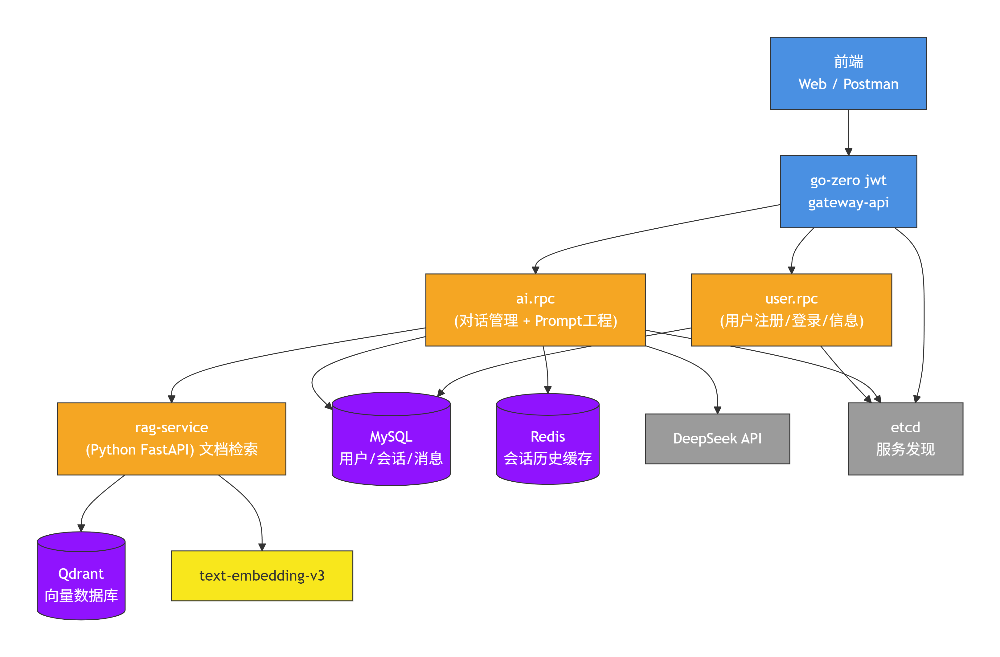
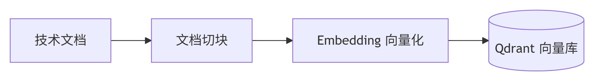
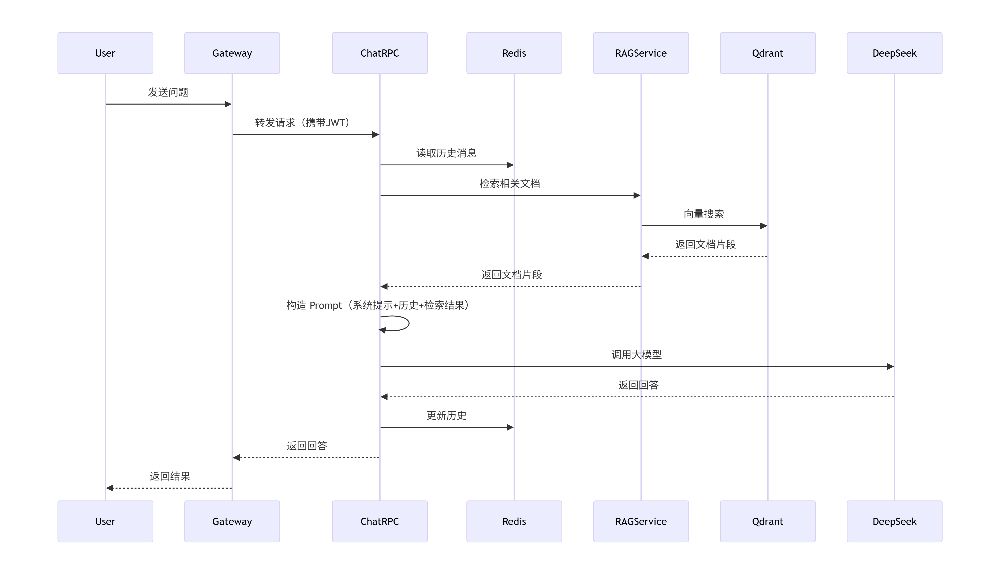
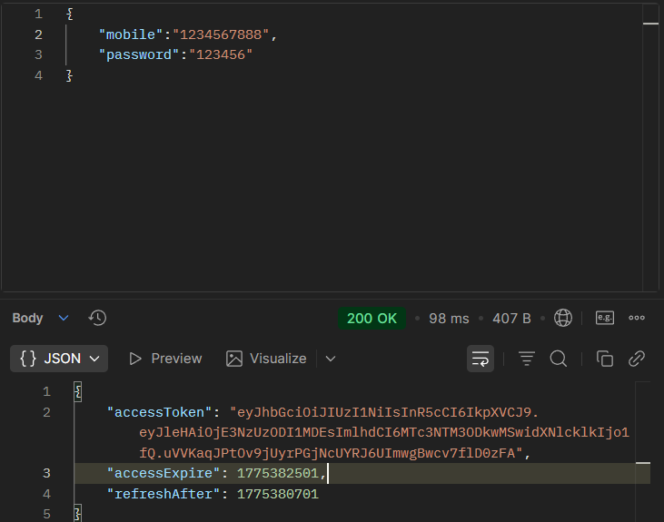
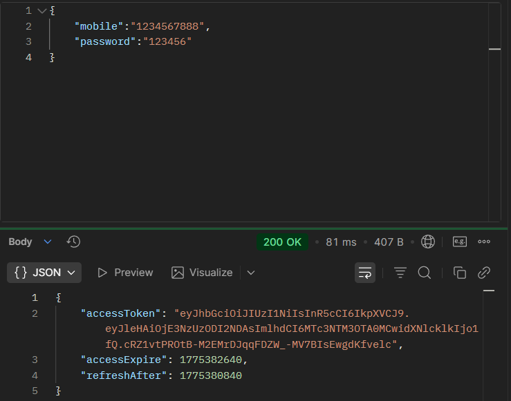
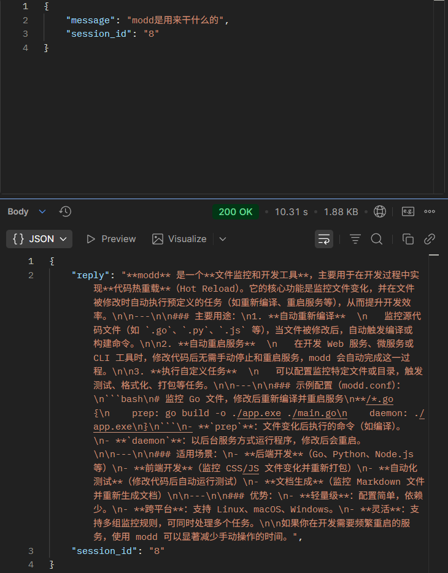
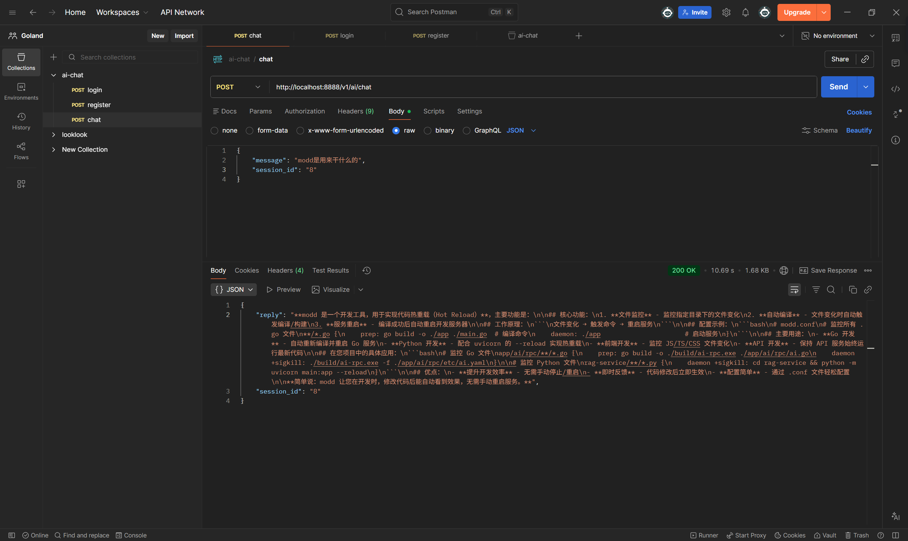

# ai-chat 技术文档问答助手 — 开发记录

## 一、项目概述

**目标**：基于技术文档的智能问答助手，利用 RAG（检索增强生成）和 Prompt 工程，帮助开发者快速从项目文档中找到答案。

**核心价值**：
- 解决大模型幻觉
- 将问答能力嵌入研发流程，提升开发效率

**技术栈**：
- Go + go-zero（微服务框架）
- MySQL（业务数据持久化）
- Redis（会话历史缓存）
- Qdrant（向量数据库）
- DeepSeek API（大语言模型）
- Python FastAPI（RAG 检索服务）
- modd（本地开发环境）
- etcd（服务发现）
- JWT（身份认证）

---

## 二、系统架构

### 2.1 目录结构
**项目目录结构如下**：
- app：Go 服务目录，包含业务逻辑、数据库操作、服务发现等。
  - ai: 包含 RAG 检索服务、Prompt 工程等子服务。
  - gateway: 包含 API 网关服务，负责路由请求到 AI 服务。
  - user: 包含用户服务，负责用户认证、注册等操作。
- build: modd构建的文件目录。
- deploy: 配置文件目录，目前仅包含数据库建库脚本。
- doc: 文档目录，包含开发文档等。
- pkg: 包目录，包含一些工具包。
- .env: 环境变量配置文件，包含数据库连接、服务发现等参数。

### 2.2 整体架构图



### 2.3 RAG 离线索引流程



### 2.4 在线对话流程



## 三、核心实现

### 3.1 Prompt 工程

**设计目标**：让模型遵循业务规则、保持输出格式一致、支持多轮对话。

**系统提示词（可配置）**：
```yaml
Prompt:
  System: |
    你是一个专业的AI助手，擅长回答技术问题和编程问题。
    请遵循以下规则：
    1. 回答要简洁、清晰，必要时使用列表或代码块。
    2. 如果用户要求解释代码，请给出具体示例。
    3. 如果用户要求生成代码，请用 markdown 代码块输出，并标明语言。
    4. 始终保持友好、专业的语气。
  MaxHistoryRounds: 5
```

**多轮对话历史管理**：
- 使用 Redis 存储最近 N 轮对话（N 可配置）
- 每次请求读取历史并拼接到 messages 数组
- 采用 JSON 序列化存储，避免复杂操作

### 3.2 RAG 检索增强生成
**3.2.1 离线索引（Python）**
使用阿里云 text-embedding-v3 模型将文档切块向量化，存入 Qdrant。
关键参数：
- 向量维度：1024
- 切块大小：500 字符
- 相似度度量：余弦相似度

**3.2.2 在线检索（Python FastAPI）**
提供 /search 接口，接收用户问题，返回相关文档片段。
```python
@app.post("/search")
async def search(req: SearchRequest):
    query_vec = get_embedding(req.query)      # 1024维
    results = qdrant.query_points(
        collection_name="tech_docs",
        query=query_vec,
        limit=req.top_k,
        with_payload=True
    )
    docs = [p.payload["text"] for p in results.points]
    return {"documents": docs}
``` 

**3.2.3 Go 服务集成**
在 ChatLogic 中调用 RAG 服务，将检索结果拼接到系统提示词中。
```go
docs, err := l.svcCtx.RagClient.Search(in.Message, 3)
if err == nil && len(docs) > 0 {
    contextStr := "\n\n参考资料：\n" + strings.Join(docs, "\n---\n")
    messages[0]["content"] += contextStr
}
// 如果没有检索到相应的内容则会自动降级，发送没有拼接检索内容的message
```

### 3.3 微服务架构
**服务拆分**：

gateway-api：统一入口，JWT 认证，路由转发

user.rpc：用户注册、登录、信息查询

ai.rpc：对话管理、历史缓存、Prompt 构造、调用 RAG 及 LLM

rag-service（Python）：独立 RAG 检索服务

**服务发现**：etcd，配置 Key 不带前导斜杠，查询时使用 ai.rpc/ 前缀。

**热加载**：使用 modd 监听文件变化，自动编译重启。

```
# modd配置文件
@buildDir = "build"

app/ai/rpc/**/*.go {
    prep: go build -o ./build/ai-rpc ./app/ai/rpc/ai.go
    daemon +sigkill: ./build/ai-rpc -f ./app/ai/rpc/etc/ai.yaml
}

rag-service/**/*.py {
    daemon +sigkill: cd rag-service && /path/to/conda/env/bin/python -m uvicorn main:app --reload --host 0.0.0.0 --port 8082
}
```

### 3.4 数据层
- MySQL：存储用户信息、会话元数据、对话记录
- Redis：缓存最近 N 轮对话历史，设置 1 小时过期
- go-zero model 层：自动生成 CRUD 代码，集成 singleflight 防缓存击穿，随机过期防雪崩

## 四、遇到的问题与解决方案

| 问题 | 现象 | 排查过程 | 解决方案 |
| :--- | :--- | :--- | :--- |
| goctl 生成代码导入路径错误 | package ... is not in std | 发现未执行 go mod init | 先 go mod init 再生成代码 |
| 多 go.mod 导致导入冲突 | 子目录有独立 go.mod | 检查项目结构 | 删除子目录 go.mod，统一使用根模块 |
| etcd 服务发现失败 | etcdctl get --prefix "/ai.rpc/" 无输出 | 查看注册 key 格式 | 查询时去掉前导 /，使用 ai.rpc/ |
| JWT 401 Unauthorized | 网关返回 401 | 对比 JWT 密钥，发现token会更新 | 统一网关和 user.rpc 的 AccessSecret |
| 数据库字段无默认值 | Field 'session_id' doesn't have a default value | 查看表结构 | ALTER TABLE 添加默认值或允许 NULL，重新生成 model |
| Redis 历史 JSON 解析错误 | unexpected end of JSON input | 检查缓存内容 | 清空测试 key，修复序列化逻辑 |
| 向量维度不匹配 | expected dim: 1024, got 1536 | 查看集合信息，打印向量长度 | 统一使用 text-embedding-v3 并显式指定 dimensions=1024 |
| Qdrant 客户端方法不存在 | 'QdrantClient' object has no attribute 'search' | 查阅新版文档 | 改用 query_points 方法 |

## 五、成果展示

### 5.1 功能演示

**使用 Postman 调用 /v1/ai/register 接口**：
  
<br> <br> 

**使用 Postman 调用 /v1/ai/login 接口**：

<br> <br> 

**使用 Postman 调用 /v1/ai/chat 接口**：

<br> <br> 



## 六、未来方向
- 引入Prometheus+Grafana监控指标
- 使用 Loki 收集日志
- 流式输出：优化用户体验
- 代码重构，把chatlogic中的辅助函数独立出来，并且可以把aiprc拆分为llm和chat两个rpc服务
- 引入消息队列，优化并发处理
- 把title修改了，自动总结对话内容
- 部署到k8s上实现高可用
- CI/CD 集成
- 压力测试

## 七、总结
通过本项目，我系统掌握了：
go-zero 微服务框架的开发与部署
RAG 技术的完整落地（离线索引 + 在线检索）
Prompt 工程的设计
服务发现、热加载等云原生实践
跨语言服务集成（Go + Python）
